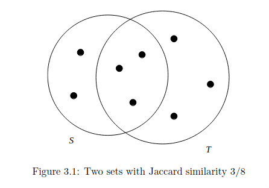
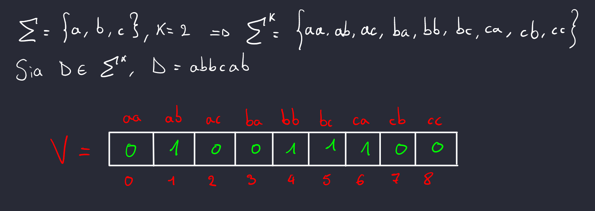
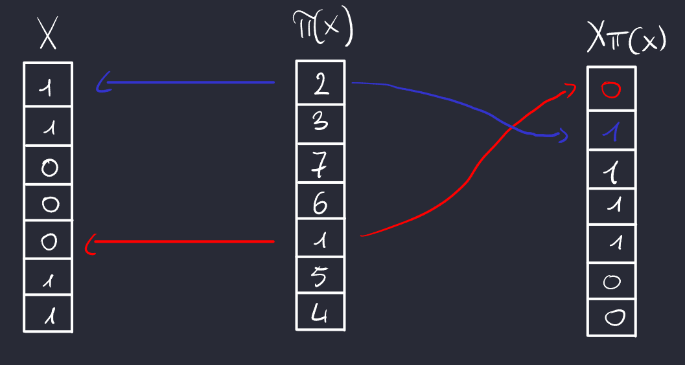
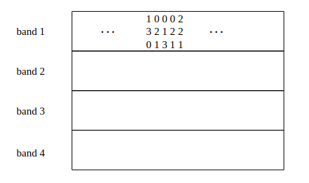
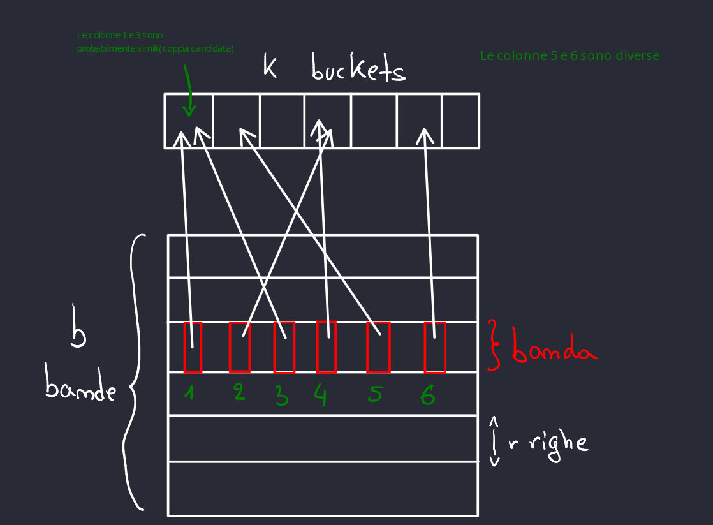
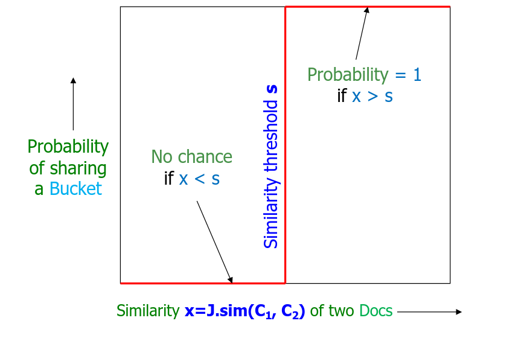
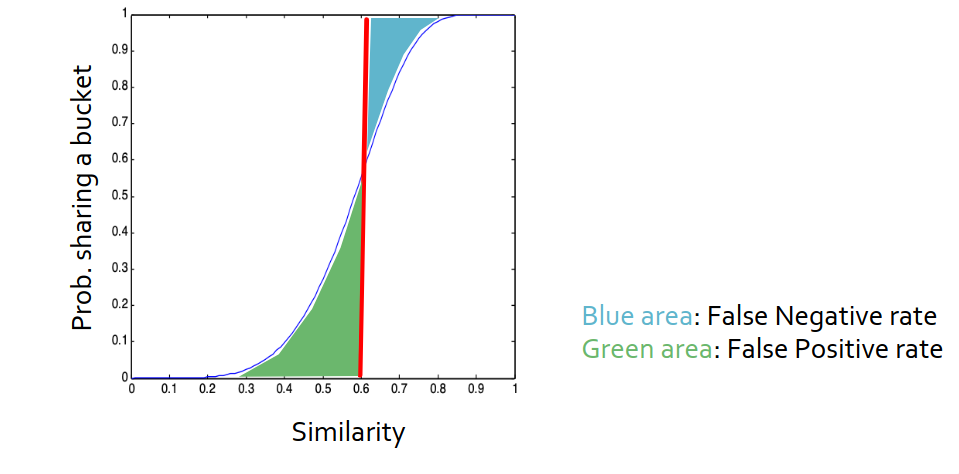

# Finding Similar Itmes - Document Similarity

Consideriamo un primo problema di data mining: la ricerca di elementi simili in un insieme di dati di grandi dimensioni. Supponiamo di avere in input un insieme $X_1, X_2, \dots , X_N​$, dove $N$ è dell'ordine di milioni o miliardi. Ogni elemento è rappresentato da dati multidimensionali; ad esempio, un’immagine può essere rappresentata come una matrice di pixel, che a sua volta può essere trasformata in un vettore appartenente a uno spazio di dimensione $h$. Anche $h$ è dell’ordine di milioni, il che significa che i dati in input non solo sono numerosi, ma anche ad alta dimensionalità.

 bisogna introdurre una funzione di distanza, $d(X_1, X_2)$ che quantifica la "distanza" tra due elementi $X_1$ e $X_2$. L'obiettivo è **trovare tutte le coppie $(X_i, X_j)$** tale che $d(X_i, X_j) \leq S$, dove $S$ è una certa soglia.

Una soluzione banale impiegherebbe tempo $O(N^2 \cdot h)$, che per quanto abbiamo visto prima, con $N$ e $h$ dell'ordine dei milioni, questa soluzione è inammissibile, in quanto troppo inefficiente. Vedremo in seguito un'algoritmo che **magicamente** impiega tempo $O(N \cdot h')$, con $h' << h$.

## Document Similarity

Passiamo ora all'argomento **Similar Items**, concentrandoci su un caso specifico da approfondire: il problema **Document Similarity**. Questo implica individuare tutte le coppie di documenti di testo che risultano simili tra loro. Tale problema ha applicazioni molto importanti in vari campi, come:

- Rilevamento di Plagio
- Identificazione di pagine web simili

### Scegliere la funzione di distanza

Ogni applicazione necessità di una funzione di distanza appropriata, nel caso del document similarity, la funzione di distanza scelta e la **Jaccard Similarity**.

!!! success
    - Definiamo la **Jaccard Similarity** di due insiemi come:
    $$J.sim(C_1, C_2) = \frac{\bigm|C_1 \cap C_2 \bigm|}{\bigm|C_1 \cup C_2 \bigm|}$$
    - Definiamo la **Jaccard Distance** di due insiemi come:
    $$J.d(C_1, C_2) = 1 - J.sim(C_1, C_2)$$

{width="300" style="display: block; margin: 0 auto"}

La domanda che sorge spontanea è: come possiamo utilizzare la Jaccard similarity, dato che richiede di lavorare su insiemi, mentre noi stiamo trattando documenti di testo?

Ricapitolando, la nostra situazione è la seguente:

Abbiamo $Doc \in \Sigma^*$, dove $\Sigma$ rappresenta l'alfabeto, e dobbiamo trovare un modo per trasformare i documenti in insiemi, così da poter applicare la Jaccard similarity.

Prima di andare nel dettaglio, osserviamo ad alto livello l'algoritmo.

1. **Input**: Un insieme grande di documenti;
2. **Shingling**: Convertire i documenti in **insiemi** (molto grandi);
3. **Min-Hashing**: Convertire gli insiemi molto grandi in piccole **firme (signatures)**, mantenendo la Jaccard similarity;
4. **Locality-Sensitive Hashing (LSH)**: LSH si concentra su coppie di firme che probabilmente appartengono a documenti simili secondo la Jaccard similarity;
5. **Output**: Ritorna le coppie di documenti candidate ad essere simili.

### Step 1. Shingling: Convertire i documenti in insiemi

Consideriamo un documento come una stringa di caratteri. Sia $\Sigma$ l'alfabeto, per esempio l'alfabeto inglese composto da 27 caratteri ($\Sigma = \{a,\ b,\ c,\ \dots\}$) e sia $\Sigma^*$ l'insieme di tutte le stringhe costituite con i caratteri di $\Sigma$. Sia $Doc \in \Sigma^*$ un documento; definiamo un $k$-shingle di un documento come una qualsiasi sottostringa (*token, che può essere formato da caratteri o parole*) di lunghezza $k$ all'interno di quel documento. Allora, associamo a ciascun documento l'insieme composto da $k$-shingles che appaiono una o più volte nel documento $Doc$.

!!! example
    Supponiamo che il nostro documento $D$ sia la stringa `abcdabd` e scegliamo $k = 2$. Allora l'insieme 2-shingles per $D$ è $\{ab, bc, cd, da, bd\}$. Osserviamo che `ab` compare 2 volte nel documento, ma una volta sola nell'insieme. Una variazione sarebbe quella di usare multinsiemi invece che insiemi per rappresentare gli shingle.

Ci sono varie possibilità riguardo i caratteri "vuoto", "tabulazione", "nuova riga", un'idea sarebbe quella di sostituire tali caratteri con semplice carattere vuoto.

Ora dobbiamo scegliere il valore di $k$. Se scegliamo un $k$ molto piccolo, ad esempio 1 o 2, è probabile che documenti completamente diversi risultino simili tra loro secondo la Jaccard Similarity, portando a molti falsi positivi. Per evitare ciò, la scelta di $k$ non dovrebbe essere casuale.

La regola generale è la seguente:

- Il valore di $k$ dovrebbe essere abbastanza grande da ridurre la probabilità che uno shingle specifico compaia casualmente in un documento qualsiasi.

Scegliendo un $k$ maggiore, riduciamo la probabilità che uno shingle si presenti in modo casuale in documenti diversi, rendendo il confronto più preciso. Un valore di $k$ più lungo permette di catturare pattern più specifici, migliorando l’affidabilità della similarità tra documenti.

In caso di documenti piccoli, come email, $k = 5$ è ragionevole. Mentre per documenti più grandi, $k = 9$ è un ottima scelta.

Sia $D \in \Sigma^*$ un documento rappresentato dal suo insieme di $k$-shingles. Se consideriamo $\Sigma^k$ l'insieme di tutti i possibili $k$-shingle ordinato, allora possiamo rappresentare $D$ come un vettore binario di dimensione $\bigm|\Sigma^k\bigm|$, dove ogni shingle è una componente di questo vettore e:

$$
v[i] = \begin{cases}
1 & \text{se l' i-esimo shingle dell'insieme ordinato } U \text{ sta nel documento} \\
0 & \text{se l' i-esimo shingle dell'insieme ordinato } U \text{ non sta nel documento}
\end{cases}
$$

{width="600" style="display: block; margin: 0 auto"}

Possiamo rappresentare un insieme di documenti come una collezione di insiemi, dove ciascun insieme è descritto da un vettore binario. Questi insiemi formano la cosiddetta matrice caratteristica, in cui le colonne corrispondono ai documenti (vettori binari) e le righe ai shingle ordinati.

| Element | S₁ | S₂ | S₃ | S₄ |
| :-----: |----|----|----|----|
| a       | 1  | 0  | 0  | 1  |
| b       | 0  | 0  | 1  | 0  |
| c       | 0  | 1  | 0  | 1  |
| d       | 1  | 0  | 1  | 1  |
| e       | 0  | 1  | 1  | 0  |

### Step 2. MinHashing: Convertire gli insiemi molto grandi in piccole **firme (signatures)**, mantenendo la Jaccard similarity

Una volta calcolata la matrice caratteristica, possiamo già iniziare a determinare le coppie di elementi simili. Tuttavia, questo calcolo richiederebbe un tempo elevato, pari a $\theta(N^2 \cdot \bigm|\Sigma^k \bigm|)$. Per ridurre questa complessità, possiamo cercare di ridimensionare la matrice, riducendo il valore di $h = \bigm|\Sigma^k \bigm|$.

La tecnica utilizzata per questa operazione è chiamata **MinHashing**. Per eseguire il *minhash* di un insieme rappresentato da una colonna della matrice caratteristica, si applica una permutazione casuale delle righe. Il minhash di una colonna è quindi l'indice della prima riga, nella colonna permutata, in cui compare un 1.

{width="600" style="display: block; margin: 0 auto"}

!!! note
    Dunque la permutazione $\pi(x)$ si legge in ordine crescente, non dalla prima posizione, ma dall'elemento 1.
!!! success
    Supponiamo che le righe della matrice $M$ sono permutate, secondo una permutazione casuale $\pi$.
    **Def**: Per ogni colonna $C$, definiamo **Min-Hash function** $h_{\pi}(c)$ l'indice della prima riga (nella permutazione $\pi$) in cui nella colonna $C$ appare il valore 1 (è lo chiamiamo $min(\pi(C))$).

Tra minhash e Jaccard similarity c'è una relazione, ovvero:

- La probabilità che la funzione di minhash, applicata su una permutazione casuale delle righe, produca lo stesso valore per due insiemi è uguale alla Jaccard similarity tra questi insiemi.

Questo significa che, se abbiamo due insiemi e applichiamo una permutazione casuale delle righe della matrice caratteristica, la probabilità che il minhash (ovvero l'indice della prima riga con un 1) sia lo stesso per entrambi gli insiemi è esattamente uguale al valore della similarità di Jaccard tra di loro.

- Se $J.sim(C_1, C_2)$ è **alta**, allora con alta probabilità $h(C_1) = h(C_2)$
- Se $J.sim(C_1, C_2)$ è **bassa**, allora con alta probabilità $h(C_1) \neq h(C_2)$

!!! success
    **Teorema | J-Similarity Preserving**: Fissate $C_1$ e $C_2$ due colonne della matrice caratteristica. Scelta uniformemente random una permutazione $\pi$. Allora
    $$Pr_{\pi}[h_{\pi}(C_1) = h_{\pi}(C_2)] = J.sim(C_1, C_2)$$

    **Dimostrazione:**
    
    Consideriamo un documento \( X \), cioè una colonna nella matrice caratteristica. Ogni riga di \( X \) corrisponde a uno *shingle* (per esempio, una sottostringa di testo), e la cella è impostata a 1 se lo shingle appartiene al documento \( X \), 0 altrimenti. Pertanto, possiamo vedere \( X \) come un insieme di shingle, con \( y \in X \) che indica uno shingle presente in \( X \) (ossia, la cella in corrispondenza di \( y \) è posta a 1).

    **Passo 1**: Calcolo della probabilità che uno shingle sia il minimo in una permutazione.

    Per una permutazione casuale $\pi$, la probabilità che uno shingle specifico $y \in X$ venga mappato come *minhash* della colonna $X$ è data da:
    \[
    \Pr[\pi(y) = \min(\pi(X))] = \frac{1}{|X|}
    \]
    poiché ogni shingle $y \in X$ ha uguale probabilità di essere il minimo rispetto a $\pi$.

    **Passo 2**: Calcolo della probabilità che $h_{\pi}(C_1) = h_{\pi}(C_2)$.

    Per stimare $J.sim(C_1, C_2)$, dobbiamo calcolare la probabilità che il *minhash* delle due colonne $C_1$ e $C_2$ sia lo stesso, ovvero $\Pr_{\pi}[h_{\pi}(C_1) = h_{\pi}(C_2)]$.

    1. Sia $y$ l'elemento tale che $\pi(y) = \min(\pi(C_1 \cup C_2))$. Ciò significa che $y$ è l'elemento con il valore minimo nella permutazione unione $C_1 \cup C_2$.
    
    2. Notiamo che:
    - Se $y \in C_1$, allora $\pi(y) = \min(\pi(C_1))$.
    - Se $y \in C_2$, allora $\pi(y) = \min(\pi(C_2))$.
    
    In altre parole, il valore minimo della permutazione per $C_1$ o $C_2$ sarà dato da uno shingle presente in almeno una delle due colonne.

    1. Il caso favorevole, in cui $h_{\pi}(C_1) = h_{\pi}(C_2)$, si verifica se e solo se $y \in C_1 \cap C_2$ (ossia, $y$ è uno shingle presente in entrambe le colonne $C_1$ e $C_2$). In tal caso, $y$ sarà il minimo in entrambe le colonne.

    2. Poiché la permutazione $\pi$ è uniforme e casuale, possiamo dire che la probabilità che il minimo di $\pi(C_1 \cup C_2)$ appartenga sia a $C_1$ sia a $C_2$ è proprio la probabilità di intersezione rispetto all'unione degli shingle, cioè:
    \[
    \Pr_{\pi}[h_{\pi}(C_1) = h_{\pi}(C_2)] = \frac{|C_1 \cap C_2|}{|C_1 \cup C_2|} = J.sim(C_1, C_2)
    \]

    **Conclusione**

    Abbiamo dimostrato che la probabilità che il *minhash* di $C_1$ sia uguale al *minhash* di $C_2$ per una permutazione casuale $\pi$ è esattamente la Jaccard Similarity tra $C_1$ e $C_2$. Questo conclude la dimostrazione.

Dalla matrice caratteristica iniziale possiamo ottenere una matrice molto più piccola, chiamata **matrice delle firme (signature matrix)**. Se applichiamo una sola permutazione casuale, la matrice delle firme sarà costituita da $N$ colonne e una sola riga. Tuttavia, aumentando il numero di permutazioni e quindi il numero di firme per ciascuna colonna, possiamo migliorare la stima della Jaccard Similarity. Questo processo di miglioramento della "fiducia" nella stima di similarità si basa sul concetto di *concentrazione intorno al valore atteso*. Di conseguenza, per ciascuna colonna otteniamo una serie di Min-Hash signatures.

Definiamo quindi la firma di un documento $C$ come un vettore di più Min-Hash signatures indipendenti:

$$SIG(C) = \langle h_{\pi_1(C)}, h_{\pi_2(C)}, \dots, h_{\pi_t(C)} \rangle$$

dove $t$ è un numero molto grande di permutazioni $(t >> 1)$. Questa raccolta di firme consente di aumentare la precisione nella stima di similarità tra due colonne.

Per due vettori di signature, $SIG(C_1)$ e $SIG(C_2)$, definiamo la similarità $Sign-Sim$ come la frazione di signature scelte in cui $C_1$ e $C_2$​ sono d'accordo (cioè hanno lo stesso Min-Hash signature). Dunque, si calcola la *media* delle similarità ottenute su tutte le permutazioni considerate. Al crescere di *t*, questa media tende al valore atteso, ovvero alla Jaccard Similarity.

**Random-Algorithm-Doc-Pair-Check**($Col_1$, $Col_2$, $T$)

- $Col_1$, $Col_2$ colonne della matrice caratteristica
- $T$ parametreo di confidenza

1. Scegli una permutazione uniformemente random $\pi_j \in \Pi_m$
2. Calcola il *minhash* $h_{\pi j}(C_1)$ e $h_{\pi j}(C_2)$
3. Return $Sign-Sim(C_1, C_2) = \frac{\bigm| \{\ j:\ h_{\pi j}(C_1)\ =\ h_{\pi j}(C_2)\ \} \bigm|}{t}$

!!! success
    **Corollario**: Per $t$ che tende a $\infty$, $Sign-Sim(C_1, C_2) = J.sim(C_1, C_2)$.

#### Complessità spaziale MinHash

Scegliamo un $t = 100$ fisso di permutazioni random delle righe. Questo numero di permutazioni viene utilizzato per generare una firma (o sketch) che rappresenta il documento o l'insieme in maniera compatta.

Sia $SIG(i, C)$ l'indice della prima riga che contiene un valore 1 nella colonna $C$ secondo la permutazione casuale $i$. Ogni valore $SIG(i, C)$ occupa spazio proporzionale a $\theta(log(|C|)) = \theta(log(m))$ dove $m$ rappresenta il numero totale di possibili $k-shingles$. L'insieme di tutti questi $SIG(i, C)$, cioè $SIG(*, C)$ rappresenta una firma del documento o dell'insieme $C$. Questa firma è compatta, circa 100 byte. In termini generali, la dimensione della firma è proporzionale a $\theta(t\ log(m))$.

In coclusione, grazie al minhash si è riusciti a "comprimere" i vettori di bit lunghi in firme più corte, cioè in **sketch**, in pratica si passa da un vettore di dimensione $m = |\Sigma|^k$ ad un vettore $t\ log(m)$.

#### Ottimizzazione MinHash

La fase di Min-Hash, quindi di comprimere la matrice grande richiede di creare diverse permutazioni random delle righe della matrice originale per ciascun documento. Sapendo che $m = |\Sigma|^k$, e supponendo di usare l'alfabeto inglese e $k = 10$, allora anche generare una **SOLA** permutazione per $27^{10}$ righe sarebbe troppo dispendioso in termini di tempo e risorse.

Invece di generare $t$ permutazioni, si sostituiscono le permutazione con le funzioni hash randomizzate (**Randomized Hash Functions**). Si scelgono $t$ funzioni hash $f_i$. Ogni funzione hash  $f_i: [m] \rightarrow [m]$, mappa le righe in modo casuale (ci potrebbe essere delle collisioni, ma vedremo che la probabilità delle collisioni è molto bassa).

#### Algortimo per il calcolo del MinHash

```javascript
// Input: Original matrix M of size m x N, number of hash functions t
// Output: Signature matrix SIG of size t x N

// Step 1: Initialize the signature matrix
for each column C = 1 to N do
    for each hash function i = 1 to t do
        SIG[i][C] = ∞    // Initialize SIG(i, C) to infinity

// Step 2: Populate the signature matrix
for each row j = 1 to m do
    for each column C = 1 to N do
        if M[j][C] == 1 then (**)           // If the element in M is 1
            for each hash function i = 1 to t do
                h_value = f_i(j)        // Compute the hash function i on row j
                if h_value < SIG[i][C] then
                    SIG[i][C] = h_value // Update SIG(i, C) with the minimum hash value

```

Osserviamo innanzitutto che questo algoritmo impiega tempo $\theta(mN)$. L'ottimizzazione di questo algoritmo sta nel fatto che non generiamo più $t$ permutazioni random delle $m$ righe, ma generiamo invece $t$ funzioni hash. Infatti per generare una permutazione delle $m$ righe impieghiamo tempo $O(m log(m))$ mentre per generare una singola funzione hash impieghiamo tempo $log(m)$. Infatti:

$$\mathcal{H} = \{h_{a,b} : [m] \rightarrow [m]\}$$
dove lo spazio per memorizzare una singola hash function è $O(log(m))$ e il tempo per generarla è $O(log(m))$.

$$\Pi(log(m!)) \approx m log(m)$$
dove lo spazio per memorizzare una singola permutazione è $O(m)$ e il tempo per generarla è $O(m log(m))$.

Inoltre, ponendo la condizione (**), possiamo usare la proprietà che la matrice caratteristica è molto sparsa, andando a calcolare la funzione hash solo per quelle righe in cui c'è un 1.

### Step 3. Locality-Sensitive Hashing: Si concentra su coppie di firme che probabilmente appartengono a documenti simili

Anche se possiamo utilizzare il minhashing per comprimere documenti di grandi dimensioni in firme ridotte che preservano la similarità attesa tra qualsiasi coppia di documenti, potrebbe comunque essere impossibile trovare in modo efficiente le coppie con la maggiore similarità. Il motivo è che il numero di coppie di documenti potrebbe essere troppo elevato, anche se i documenti non sono particolarmente numerosi.

!!! example
    Supponiamo di avere un milione di documenti e di utilizzare firme di lunghezza 250. In questo caso, utilizziamo 1000 byte per documento per le firme, e l'intero dataset occupa un gigabyte – meno della memoria principale tipica di un laptop. Tuttavia, ci sono $\binom{1.000.000}{2}$, ovvero mezzo trilione di coppie di documenti. Se occorre un microsecondo per calcolare la similarità tra due firme, sarebbero necessari quasi sei giorni per calcolare tutte le similarità su quel laptop.

Dunque l'obiettivo principale dell'approccio **LSH** è ridurre il numero di confronti necessari per identificare coppie simili in un insieme di elementi, evitando il confronto tra ogni coppia possibile.

L'idea generale è di usare una funzione hash universale usata per "hashare" gli elementi in una hash table in modo tale che gli elementi simili abbiano maggiore possibilità di essere hashati nello stesso bucket rispetto agli elementi diversi.

Alla fine di questo procedimento, per vedere quali sono le possibili coppie *candidate*, andiamo a considerare ciasun bucket, sapendo che in un bucket sono stati mappati tutte quelle possibili coppie candidate ad essere simili. L'obiettivo è che la maggior parte delle coppie diverse non venga mai hashata nello stesso bucket e quindi non venga mai controllata. Le coppie diverse che invece vengono hashate nello stesso bucket sono falsi positivi. Tali coppie possono essere poi facilmente controllate alla fine, andando a fare una ricerca nella matrice caratteristica, ovvero nella matrice degli shingling. Allo stesso modo, si spera che la maggior parte delle coppie effettivamente simili venga hashata nello stesso bucket. Quelle che non lo fanno sono falsi negativi, e l'obiettivo è di minimizzare il numero di tali coppie, poiché è molto difficile andare a controllare quali siano.

- **Falso Positivo**: Sono tutte quelle coppie che non risultano simili ma che vengono mappate nello stesso bucket. Qui basta semplicemente prendere tutte le coppie candidate che sono molto di meno rispetto $N$ documenti inziali, e andare ad efettuare un ulteriore controllo nella matrice caratteristica.
- **Falso Negativo**: Sono tutte quelle coppie che risultano simili ma che vengono mappate in bucket diversi. Qui il problema sta nel identificare quali siano queste coppie.

Quindi, dato in input una soglia limite $s\ (0 < s < 1)$, allora

!!! info
    **Def**: Due colonne $x$ e $y$ sono dette **coppie candidate** se la loro firma $SIG(*, x)$ e $SIG(*, y)$ concordano su almeno una frazione $s$ delle loro righe, ovvero:
    $$\frac{\left| \{i \in [t]: SIG(i, x) = SIG(i, y)\}\right|}{t} \geq s$$

!!! note
    La similarità tra le firme di due colonne non deriva da piccole differenze in alcuni o diversi valori delle loro righe: ma richiede che un numero significativo di valori (o la maggior parte) delle righe sia identico tra due colonne!

Poiché hashare l'intera colonna delle firme in un unico bucket può generare molti falsi positivi e falsi negativi, possiamo adottare un approccio alternativo basato sempre su LSH.

Quando disponiamo delle firme MinHash per gli elementi, un metodo efficace consiste nel dividere la matrice delle firme in $b$ **bande**, ciascuna formata da $r$ **righe**. Per ogni banda, si calcola un hash unico del vettore di $r$ righe (ovvero la porzione corrispondente della colonna).

{width="400" style="display: block; margin: 0 auto"}

Questa divisione introduce un vincolo più forte per considerare due colonne simili: devono avere valori identici in **tutte** le righe di almeno una banda per essere mappate nello stesso bucket. In altre parole:

- Colonne simili (con valori identici nella maggior parte delle righe) hanno una buona probabilità di finire nello stesso bucket in almeno una banda, diventando coppie candidate.
- Colonne diverse difficilmente avranno valori identici in tutte le righe di una banda e quindi saranno escluse come candidate.

Quindi, due colonne sono considerate coppie candidate secondo la Jaccard similarity se almeno una banda è mappata nello stesso bucket. Questo approccio riduce i falsi positivi e negativi rispetto all’hash dell’intera colonna, bilanciando precisione ed efficienza.

{width="500" style="display: block; margin: 0 auto"}

#### Esempio

Analizziamo un esempio di LSH applicato per identificare coppie di documenti simili, supponendo il seguente scenario:

- Numero di documenti: $N = 100,000$ (ciascun documento è rappresentato come una colonna).
- Dimensione delle firme (signature): Ogni documento è rappresentato da una firma di $100$ interi ($t =100$ righe totali per firma).
- La firma rappresenta una sintesi del contenuto del documento (generata usando tecniche come il MinHash).
Complessivamente, le firme occupano circa 40 MB in memoria.

Adesso dobbiamo capire come suddividere le righe:

- Si suddivide ogni firma in $b = 20$ bande. Ogni banda contiene $r=5$ righe.
- Questo implica che la firma di 100 righe è divisa in $b \times r = 20 \times 5 = 100$ righe totali, corrispondenti esattamente alla lunghezza della firma.

In input, oltre ai documenti prendiamo un parametro $s$, ovvero la soglia di similitudine, in questo caso supponiamo $s = 0.8$. Quindi l'obiettivo è trovare tutte le coppie di documenti con Jaccard Similarity $\geq 0.8$.

1. **Primo caso**, assumiamo che date due colonne $C_1$ e $C_2$, $J.sim(C_1, C_2) = 0.8$.

    !!! note
        Affinché $C_1$ e $C_2$​ siano considerate una **coppia candidata**, devono avere nello stesso bucket almeno una banda in comune. Questo implica che le loro righe in quella banda devono essere identiche.

    - **Fatto 1: Probabilità che $C_1$ e $C_2$​ siano identiche in una banda**,
      - In una banda di 5 righe $(r = 5)$, la probabilità che tutte le righe corrispondano è $(0.8)^5 = 0.328$. Questo deriva dal fatto che, con $J.sim = 0.8$, ogni riga ha una probabilità di $0.8$ di essere identica.
    - **Fatto 2: Probabilità che $C_1$ e $C_2$ non siano identiche in tutte le 20 bande**,
      - Se in una banda la probabilità che 2 righe non corrispondono è $1 - 0.328 = 0.672$, allora la probabilità che non corrispondano in nessuna delle 20 bande è $(0.672)^{20} \approx 0.00035$.

    Quindi, in conclusione abbiamo che la probabilità che $C_1$​ e $C_2$​ non siano mai candidate (nessuna banda uguale) è $0.00035$, cioè $0.035 \%$. Questo significa che c'è una bassissima probabilità di **falsi negativi**, ovvero di perdere coppie realmente simili. In pratica, si riescono a identificare il $99.965 \%$ delle coppie di documenti realmente simili.

2. **Secondo caso**, assumiamo che date due colonne $C_1$ e $C_2$, $J.sim(C_1, C_2) = 0.3$, quindi in questo caso si spera che con poca probabilità nessuna delle bande di $C_1$ e $C_2$ finiscano nello stesso bucket.

   - **Fatto 1: Probabilità che $C_1$ e $C_2$​ siano identiche in una banda**,
     - In una banda di 5 righe $(r = 5)$, la probabilità che tutte le righe corrispondano è $(0.3)^5 = 0.00243$. Questo deriva dal fatto che, con $J.sim = 0.3$, ogni riga ha una probabilità di $0.3$ di essere identica.
   - **Fatto 2: Probabilità che $C_1$ e $C_2$ non siano identiche in tutte le 20 bande**,
     - Se in una banda la probabilità che non corrispondono in una banda è $1 - 0.00243 = 0.99757$, allora la probabilità che non corrispondano in nessuna delle 20 bande è $(0.99757)^{20} \approx 0.9526$. Dunque, la probabilità che vengano hashate nello stesso bucket **alemno una volta (evento falso positivo)** è $1 - 0.9526 = 0.0474$

   Quindi, in conclusione, circa il $4.74 \%$ delle coppie di documenti con $J.sim(C_1, C_2)=0.3$ vengono considerate coppie candidate. Questo è un **falso positivo**, poiché queste coppie vengono selezionate come candidate ma non soddisfano la soglia di similarità $s$. Tale percentuale non è un problema così grande, in quanto i falsi positivi possono essere poi controllati usando la matrice caratteristica degli shingles. Il problema si verifica quando il numero di falsi negativi è troppo grande in quanto è molto più difficile identificare tali coppie.

#### Analisi LSH

In un scenario ideale, LSH è in grado di separare in modo perfetto i documenti simili da quelli non simili, a patto di impostare correttamente la soglia di similarità. Tuttavia, nella realtà, LSH non è perfetto e ci possono essere dei casi in cui documenti simili non vengono raggruppati o viceversa. Quindi in un scenario ideale, data una soglia di similitudine $s$ vorremmo che: presa una coppie di documenti/colonne $C_1$ e $C_2$, se $J.sim(C_1, C_2) = x$.

- Se $x > s$ la probabilità che queste due colonne siano simili deve essere pari a 1, altrimenti;
- Se $x < s$, allora con probabilità 0 queste due colonne non sono classificate come simili.

{width="500" style="display: block; margin: 0 auto"}

Vediamo adesso come poter generalizzare le formule viste nell'esempio precedente. Supponiamo di avere due colonne $C_1$, $C_2$, con $J.sim(C_1, C_2) = x$ e scegliamo una qualsiasi banda $b$ con $r$ righe, allora:

##### Per una singola Banda (con $r$ righe)

- **Probabilità che tutte le righe nella banda siano uguali:**

  \[
  \Pr\{\text{tutte le righe uguali}\} = x^r
  \]

- **Probabilità che almeno una riga nella banda sia diversa:**

  \[
  \Pr\{\text{almeno una riga diversa}\} = 1 - x^r
  \]

##### Per $b$ Bande

- **Probabilità che nessuna banda sia identica:**

  \[
  \Pr\{\text{nessuna banda identica}\} = \left( 1 - x^r \right)^b
  \]

- **Probabilità che almeno una banda sia identica:**

  \[
  \Pr\{\text{almeno una banda identica}\} = 1 - \left( 1 - x^r \right)^b
  \]

La probabilità che almeno una banda sia identica **aumenta** con \( b \) (il numero di bande) e **diminuisce** con \( r \) (il numero di righe per banda).

Quindi, data una soglia $s$, per bilanciare il numero di falsi positivi/negativi, possiamo regolare il numero $t$ di funzioni hash per la fase di **Minhash**, il numero $b$ di bande e infine il numero $r$ di righe per ciascuna banda. Trovando il giusto tradeoff tra questi 3 parametri, possiamo bilanciare in modo efficace il numero di falsi positivi e negativi.

Scelta bilanciata: Per ottimizzare il sistema, si considera una soglia bilanciata della forma:
$$s \approx \left(\frac{1}{b}\right)^{\frac{1}{r}}$$

Questa formula cerca di bilanciare il compromesso tra individuare documenti simili e ridurre i falsi negativi e positivi.

!!! example
    Un esempio con $t = 50$ funzioni hash, quindi $b = 10$ e $r = 5$
    {width="400" style="display: block; margin: 0 auto"}
