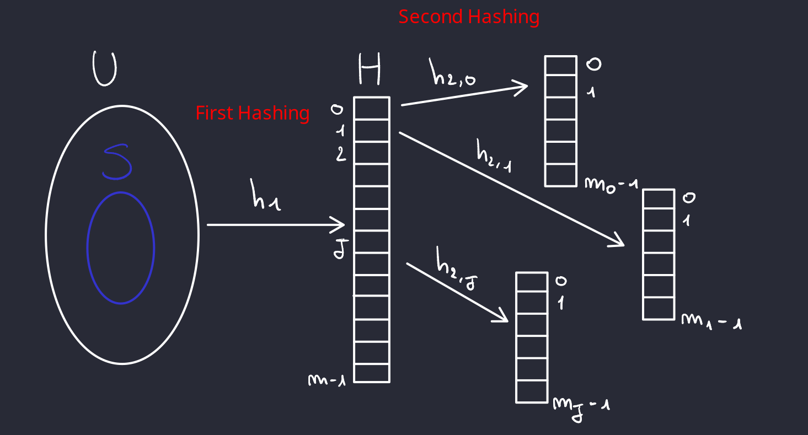

# Hash Table

## Problema del dizionario

Dato un universo $U$ di possibili elementi, dobbiamo mantenere un sott'insieme $S \subseteq U$ soggetto alle seguenti operazioni:

- `make-dictionary()`: crea un dizionario vuoto
- `insert(u)`: aggiungi l'elemento $u \in U$ a $S$
- `delete(u)`: cancella $u$ da $S$ se $u \in S$
- `look-up(u)`: determina se $u$ sta in $S$

Il problema che $U$ può avere una dimensione molto grande, e definire un array di tale dimensione non è efficiente.

**Soluzioni**:

- *Deterministica* - AVL: $O(|S|)$ spazio e $O(log(|S|))$ costo per ogni operazione.
- *Randomizzata* - Hash Tables: $O(|S|)$ spazio e $O(1)$ costo per ogni operazione.

{width="400" style="display: block; margin: 0 auto"}

### Idea

L'idea è quella di tenere in memoria un tabella (array $H$) e ogni $H[i]$ è una linked list di elementi mappati dalla funzione di hash.

Una **collisione** avviene quando, dati due elementi $u \in U$ e $v \in V$ tali che $u \neq v$, e $h(u) = h(v)$.

L'obiettivo è trovare una funzione $h$ di hash tale che rispetti le seguenti caratteristiche:

1. Deterministica: La stessa chiave deve produrre lo stesso indice.
2. Uniforme: Le chiavi devono essere distribuite uniformemente nell'array per minimizzare le collisioni.
3. Veloce da calcolare: Dovrebbe essere computazionalemente efficiente per garantire l'accesso rapido.

- **Fatto I**: Se $|U| > m^2$, per ogni funzione hash $h$ deterministica esiste un insieme $S$ di dimensione $n$ tale che tutti gli elementi di $S$ sono mappati nello stesso slot.
- **Dimostrazione**: Fissato $h$ che dovrà mappare ciascun elemento di $U$ in $H$, e $S$ può essere scelto in modo opportuno dall'"avversario" rispetto ad $h$. Dunque esiste almeno uno slot $i$ di $H$ la cui lista di trabocco ha dimensione $n$. Dunque il costo per ogni operazione è $\theta(n)$

### Randomized Hash Functions

In questo approccio iniziale, si tenta di mappare ogni elemento $u \in S$ a uno slot in $H$ in modo indipendente e uniforme. Questo significa che, per ogni elemento $u$, scegliamo $h(u)$ (il valore hash di $u$) come un numero random tra gli slot disponibili di $H$.

Poiché ogni slot in $H$ ha uguale probabilità di essere scelto, la probabilità che un elemento $u$ venga mappato a uno specifico slot $i$ è data da:
$$Pr[h(u) = i] = \frac{1}{m}$$
dove $m$ è il numero di slot di $H$.

Quando vogliamo fare un'operazione di `insert` o `lookup` per un elemento $u$, generiamo $h(u)$ come un valore random tra gli slot. Tuttavia, dato che $h(u)$ è scelto casualmente ogni volta, non c'è alcuna garanzia che la stessa chiave $u$ venga mappata sempre allo stesso indice.
Di conseguenza, la stessa chiave $u$ potrebbe essere associata a indici diversi in momenti diversi, rendendo difficile trovare dove $u$ sia stato inserito in precedenza.

Per ovviare a questo problema, è necessario memorizzare esplicitamente ogni coppia $(u,\ h(u))$. Così, ogni volta che vogliamo fare una ricerca (`lookup`), possiamo trovare la posizione esatta di $u$ senza dipendere dalla generazione casuale di $h(u)$.

Tuttavia, memorizzare tutte le coppie $(u,\ h(u))$ equivale essenzialmente a tenere traccia di ogni elemento con il proprio valore hash associato, trasformando questo sistema in un dizionario o una mappa in cui ogni chiave ha un valore associato (quindi stiamo cercando di risolvere il problema del dizionraio mediante un dizionari).

!!! success
    Una famiglia $\mathbb{H}$ di funzioni hash si dice **universale** se per ogni $u,\ v \in U\ u \neq v$ la probabilità $\Pr_{h \in \mathbb{H}} [h(u) = h(v)] \leq \frac{1}{m}$

Questo significa che una famiglia di funzioni hash è considerata universale se la probabilità che due elementi distinti $u$ e $v$ dell'universo $U$ vengano mappati allo stesso valore è al più $\frac{1}{m}$ dove $m$ è la dimensione dell'intervallo delle funzioni hash.

!!! success
    **Teorema**: Sia $\mathbb{H}$ una famiglia di funzioni hash universale. Sia $S \subseteq U$ di $n$ elementi. Sia $u \in S$. Scegliamo uniformemente random una funzione $h$ all'interno di $\mathbb{H}$ e sia $X$ una varibiale aleatoria che conta il numero di elementi di $S$ mappati nello slot $h(u)$. Allora $$E[X] = 1 + \frac{n}{m}$$
    **Dimostrazione**: Fissato $u$, per ogni $s \in S$,
    $$
    X_s = \begin{cases}
    1 & \text{se } h(s) = h(u) \\
    0 & \text{altrimenti}
    \end{cases}
    $$
    e $X = \sum_{s \in S} X_s$.
    $$E[X] = E\bigm[\sum_{s \in S} X_s\bigm] = \sum_{s \in S} E[X_s] = \sum_{s \in S} Pr[h(s) = h(u)] = 1 + \sum_{s \in S-\{u\}} Pr[h(s) = h(u)] \leq 1 + \frac{n}{m}$$

**Osservazione**: Il teorema ci dice che, fissato un elemento $u \in S$, il numero atteso di elementi in $S$ mappati nello stesso bucket di $h(u)$ è $E[X] = 1 + \frac{n}{m}$. Questo significa che nel bucket associato a $h(u)$, oltre a $u$ stesso, ci aspettiamo in **MEDIA** $\frac{n}{m}$ altri elementi di $S$.
Conoscendo $n$, possiamo scegliere $m = O(n)$ in modo tale che la dimensione di ciascun bucket sia $\approx O(1)$. In altre parole, **se il numero di bucket è proporzionale al numero di elementi**, ci aspettiamo che ogni bucket contenga in media un numero costante di elementi.

### Una prima famiglia di funzioni hash randomizzate

Come progettisti della funzione hash, ci è dato sapere alcune informazioni: $|U| = N$, $|S| = n$. Adesso con queste informazioni dobbiamo determinare la dimensione corretta della Hash Table. Sia $m$ dunque la dimensione della Hash Table, un numero **primo** tale che $n \leq m \leq 2n$, e tale numero $m$ esiste sempre grazie ad un teorema dimostrato da *Chebyshev*.

Il secondo step, è quello di codificare ciascun elemento $x \in U$ come un intero in base $m$, di $r$ cifre, $x = \langle x_1, x_2, \dots, x_r \rangle$. La quantità totale di combinazioni possibili con $r$ cifre è $m^r$. Per garantire che ogni elemento dell'universo possa essere rappresentato senza collisioni, è necessario che il numero totale di combinazioni sia almeno pari al numero di elementi nell'universo, ovvero deve vale che $m^r \geq N$.

$$
m^r \geq N \Rightarrow log(m^r) \geq log(N) \Rightarrow r\ log(m) \geq log(N) \Rightarrow r \geq \frac{log(N)}{log(M)}
$$

Definiamo ora una generica funzione hash della nostra famiglia $\mathbb{H}$. Per ogni $a \in U$ fissato, scriviamo $a$ in $m$-ario, ovvero $a = \langle a_1, a_2, \dots, a_r \rangle$, dove $a_i \in [m]$ per ogni $i = 1, 2, \dots, r$.

$$h_a(x) = \bigm(\sum_{i = 1}^{r} a_i x_i\bigm)\ mod\ m$$

Quindi, la nostra famiglia di funzioni $\mathbb{H} = \{h_a : a \in U\}$. Per memorizzare una singola funzione $h$, necessitiamo di $r = \theta(\frac{log(N)}{log(M)})$ cifre, ciascuna di dimensione $log(m)$.

#### Costo computazionale nel modello RAM

Nel modello **RAM (Random Access Machine)**, supponiamo che ogni operazione aritmetica su parole (addizioni e modulo) richieda $O(1)$ tempo. Questo ci consente di:

- Accedere a ciascun valore $a_i$ e moltiplicarlo per $x_i$ in tempo $O(1)$.
- Sommare i prodotti parziali e fare il modulo $m$, tutto in tempo costante.

Nel modello **RAM**

- **Memorizzare** una funzione $h_a$ richiede $O(1)$ spazio per la stringa $a$.
- **Calcolare** $h_a (x)$ richie $O(1)$ tempo grazie all'accesso e alla manipolazione costante delle parole.

Pertanto, il costo complessivo per memorizzare e computare $h_a(x)$ è molto efficiente e supporta operazioni di hashing rapide nel modello a registri (RAM).

!!! success
    **Teorema**: $\mathbb{H} = \{h_a : a \in U\}$ è universale.
    **Dimostrazione**: Per dimostrare che $\mathbb{H} = \{h_a : a \in U\}$ è universale dobbiamo dimostrare che, presi due elementi $x = (x_1, x_2, \dots, x_r) \in U$ e $y = (y_1, y_2, \dots, y_r) \in U$, tale che $x \neq y$,
    $$Pr[h_a(x) = h_a(y)] \leq \frac{1}{m}$$
    Siccome $x \neq y$, allora $\exists\ j$ intero tale che: $x_j \neq y_j$.
    $$Pr[h_a(x) = h_a(y)] = Pr\bigm[\sum_{i = 1}^r a_i x_i\ mod\ m = \sum_{i = 1}^r a_i y_i\ mod\ m\bigm]$$
    Adesso, da entrambi i termini tiriamo fuori $x_j$ e $y_j$ che per ipotesi sono diversi.
    $$Pr\bigm[a_j(x_j - y_j) = \sum_{i = 1, i \neq j}^r a_i(x_i - y_i)\ mod\ m\bigm]$$
    Per il *Principle Of Deffered Decision*, $\sum_{i = 1, i \neq j}^r a_i(x_i - y_i)\ mod\ m$ è un numero fissato non più una variabile random, dunque l'unica variabile random è $a_j$. La probabilità che valga quell'uguaglianza è $\frac{1}{m}$ in quanto è la probabilità di scegliere $a_j \in [m]$ necessario per rendere verà l'uguaglianza.

    **Conclusione**: $\mathbb{H} = \{h_a : a \in U\}$ è universale in quanto $Pr[h_a(x) = h_a(y)] \leq \frac{1}{m}$.

### Una seconda famiglia di funzioni hash randomizzate

- TODO: Lezione martedì 12-11-24

## Perfect Randomized Hashing - Optimal Static Dictionary

Il **perfect hashing** è un tipo di hash usato per la creazione di dizionari statici, ovvero dove il data set è fisso e non cambia dopo la sua costruzione. Questa tecnica garantisce che non ci sono collisioni, ogni chiave nel dizionario è mappata in un'unico slot della hash table.

Quindi il probleda del dizionario staitico consiste in: dato un insieme $S$ di $n$ elementi (chiavi), l'obiettivo è costruire una struttura dati che supporti solo l'operazione di `search`. Con il perfect hashing si ottengono le seguenti prestazioni:

- $O(1)$ tempo di `search` nel caso peggiore.
- $O(n)$ spazio.
- Tempo di costruzione quasi lineare con alta probabilità.

### Costruzione del dizionario

Un approccio usato del perfect hashing è quello di usare una funzione hash a 2 livelli.

1. Il primo livello partiziona le chiavi in bucket usando una hash function.
2. Ogni bucket è poi mappato individualmente, e inoltre, ciascun bucket ha la propria funzione hash randomizzata per mappare poi i singoli elementi garantendo 0 collisioni.

{width="400" style="display: block; margin: 0 auto"}

#### Step 1

1. Scegliamo uniformemente random una funzione hash universale $h_1: U \rightarrow \{0, 1, 2, \dots, m - 1\}$. Ricordiamo che una funzione hash universale ha questa proprietà: $\Pr_{h \in \mathbb{H}} [h(u) = h(v)] \leq \frac{1}{m}$, ovvero minimizza le collisioni.
2. Il valore di $m$ è scelto proporzionalmente al numero di elementi $n$ dati in input, ovvero $m = \theta(n)$, principalmente $m$ è un numero primo.
3. Dopodichè, usando $h_1$, si mappano tutti gli elementi di $S$ nella tabella principale. Se più elementi vengono mappati allo stesso slot, si crea una lista concatenata (linked list) per contenere tutti gli elementi in collisione, gestendo così le collisioni.

#### Step 2

Ora gestiamo le collisioni del **Step 1** creando tabelle hash individuali per ogni slot che ha più elementi.

1. Per ogni slot $j \in \{1, 2, \dots, m - 1\}$ prendiamo tutti gli elementi che sono stati mappati nel $j$-esimo slot da $h_1$. Sia inoltre $n_j$ il numero di elementi mappati nello slot $j$.
2. Scegliamo ora, per ogni $j$, scegliamo uniformemente random una senconda funzione hash universale $h_{2,j}$ che mappera ciascun elemento della linked list relativa allo slot $j$ in una seconda tabella. La dimensione di tale tabella è $n^2_j \leq m_j \leq O(n^2_j)$. Tale scelta di $m$ ci garantisce abbastanza spazio per memorizzare tutti gli elementi mappati nello slot $j$ evitando collisioni.
3. Per ogni slot $j$ per cui ci sono state collisione al primo step, sostituiamo la linked list con una tabella di dimensione $m_j$. Gli elementi di questa tabella saranno mappati dalla funzione hash $h_{2,j}$, eliminando definitivamente le collisioni.

Oltre a questi 2 step, vi sono degli step interdeti. I step 1.5 e 2.5 aggiungono dei controlli e verifiche al processo di costruzione della tabella hash per garantire che la struttura finale sia efficiente e senza collisioni a livello del secondo hash.

#### Step 1.5

Dopo aver scelto la funzione hash h1h1​ e aver mappato tutti gli elementi di SS nei vari slot della tabella principale, si aggiunge un controllo per verificare se il risultato è efficiente.

1. Per ciascuno slot $j$ della tabella principale, contiamo il numero di elementi $n_j$ che sono stati mappati in quello slot tramite $h_1$. La somma $\sum_{j = 0}^{m - 1} n^2_j$ rappresenta il totale dei quadrati dei numeri di elementi in ciascuno slot.
2. Se questa somma supera una certa soglia, ossai se:
$$\sum_{j = 0}^{m - 1} n^2_j > c \cdot n$$
per un valore costante $c$ (che verrà scelto più avanti), allora si decide di **rifare il passo 1** (ovvero, di scegliere una nuova funzione hash $h_1$, e di rifare la mappatura degli elementi). Questo passaggio serve per limitare la concentrazione di elementi in alcuni slot, il che potrebbe rendere il secondo livello inefficiente se ci fossero troppi elementi in un singolo slot. Rifacendo il primo passaggio, si cerca una distribuzione migliore dei njnj​, riducendo la probabilità di avere slot troppo carichi.

#### Step 2.5

Una volta che siamo passati al secondo livello, per ogni slot $j$ che contiene più elementi (ossia, per ciascun $j$ con $n_j > 1$), creiamo una hash table dedicata per quel gruppo di elementi usando una seconda funzione hash $h_{2,j}$​.
Tuttuavia, c'è ancora la possibilità che, nel secondo livello, ci siano collisioni per alcuni elementi nella tabella secondaria di un dato slot.

1. Per ogni coppia di elementi $u$ e $v$ mappati nel secondo livello tramite $h_{2,j}$, si controlla che $h_{2,j}(u) \neq h_{2,j}(v)$. Se $h_{2,j}(u) = h_{2,j}(v)$ (cioè se si verifica una collisione al secondo livello per lo stesso slot $j$), allora si sceglie una nuova funzione hash $h_{2,j}$ dalla famiglia universale e si rimappano tutti i $n_j$ elementi nel secondo livello per quello slot $j$.
2. Si continua a ripetere questo processo finché non troviamo una funzione hash $h_{2,j}$ che mappa tutti gli $n_j$ elementi in slot unici della tabella secondaria, garantendo che non ci siano collisioni a livello del secondo hash e usando spazio lineare.

### Analisi del tempo computazionale per la costruzione del dizionario

Si studia ora il tempo di costruzione della struttura dati impiegato dall'algoritmo.
Ricordando che il calcolo di una delle funzioni hash universali viste in precedenza richiede tempo costante, si ha che i passi $(1)$ e $(2)$ richiedono tempo $O(n)$.

Rimane ora da analizzare per quante volte andiamo a ripetere gli step $1.5$ e $2.5$.

!!! note
    Se $\bigm| S \bigm| = n$ allora $\sum_{j = 0}^{n - 1} n_j = n$ **ma** siccome abbiamo posto $m_j = \theta(n_j^2)$ potremmo avere che $\sum_{j = 0}^{n - 1} m_j = \sum_{j = 0}^{n - 1} \theta(n_j^2) = \omega(n)$, ovvero occupiamo molto più spazio rispetto a spazio lineare. Dunque questo rappresenta il nostro evento "cattivo", che non deve mai succedere.

- Dunque, per il passo $(2.5)$ si ha che
\[
\begin{aligned}
    Pr_{h_{2,j}}[h_{2,j}(u) = h_{2,j}(v), \; u \neq v]
    &\leq \sum_{\substack{u, v \in S \\ u \neq v \\ h_1(u) = h_1(v)}} Pr[h_{2,j}(u) = h_{2,j}(v)] \\
    &\leq \frac{1}{2} n_j (n_j - 1) \\
    &= \frac{n_j (n_j - 1)}{2 n_j^2} \\
    &= \frac{n_j - 1}{2 n_j} \\
    &< \frac{1}{2}.
\end{aligned}
\]

Dove:

- $Pr_{h_{2,j}}[h_{2,j}(u) = h_{2,j}(v)] < \frac{1}{m_j} = \frac{1}{n_j^2}$ in quanto $m = \theta(n_j^2)$ e $h_{2,j}$ è una funzione hash universale.
- $\{u, v \in S\ u \neq v\ h_1(u) = h_1(v)\}$ rappresenta l'insieme di tutte le possibili coppie di elementi mappati nello stesso slot da $h_1$ è sono: $\binom{n_j}{2} = \frac{n_j(n_j - 1)}{2}$.

Quindi, ogni prova è come un lancio di moneta. Se l'esito è "testa", si passa allo step successivo. Si ha quindi che $E [\text{numero di prove}] \leq 2$ , ovvero, in media sono neccessari 2 iterazioni dello step per slot $(2.5)$.

Tuttavia, quando vogliamo garantire che tutti gli slot $j$ abbiano una distribuzione priva di collisioni, dobbiamo prendere in considerazione un evento complessivo su più slot contemporaneamente. È qui che entra in gioco la **concentrazione delle probabilità**.

Grazie alla concentrazione delle probabilità, possiamo dire che, con alta probabilità, il massimo numero di tentativi richiesto per ottenere un successo per tutti gli slot $j$ non supererà $O(log(n))$.

Questo è un risultato comune in probabilità: se si ha una bassa probabilità di fallimento per ciascun evento indipendente (in questo caso, ciascuno slot $j$), allora per **il principio di unione e il lemma di Chernoff (disuguaglianza di Chernoff)**, possiamo dire che il numero massimo di tentativi necessari sarà solo $O(log(⁡n))$, invece di un valore molto più alto.

In sintesi, il $O(log(n))$ deriva dal fatto che vogliamo una garanzia con alta probabilità per tutti gli slot simultaneamente, e la concentrazione delle probabilità ci permette di ottenere questa garanzia limitando i tentativi a $O(log(n))$.

In conclusione, per ogni $j$, facciamo in media 2 tentativi, quindi per la **Chernoff inequality**, effettuiamo $log(n)$ tenativi, ciascun tentativo richiede $O(n_j)$ tempo, quindi:
$$\sum_{j}(\text{ numero tentativi per } j)O(n_j) = \sum_{j}log(n)O(n_j) = O(n log(n))$$

- Passiamo ora al passo $(1.5)$.
Si vuole dimostrare che $E\bigm[ \sum_{j = 0}^{m - 1} n_j^2 \bigm] = \theta(n)$, tale sommatoria rappresenta la somma dei quadrati del numero di elementi mappati in ogni slot $j$. Se molti elementi si accumulano nello stesso slot, questo valore cresce, indicando una struttura inefficiente. Ci serve dimostrare questa uguaglianza per poter applicare poi la disuguaglianza di Markov.

Definiamo la variabile aleatoria:
\[
X_{u,v} =
\begin{cases}
1 & \text{se } h_1(u) = h_1(v) \\
0 & \text{altrimenti}
\end{cases}
\]

Dove $h_1$ è la funzione hash scelta casualmente, e $X_{u,v} = 1$ indica che c'è una collisione tra $u$ e $v$.

!!! info
    $$\sum_{j = 0}^{m - 1} n_j^2 = \sum_{u \in S}\sum_{v \in S}X_{u,v}$$
    - **Dim**
    $$\sum_{u \in S}\sum_{v \in S}X_{u,v} = n_1 \times n_1 + n_2 \times n_2 + \dots + n_m \times n_m$$
    Dove $n_j \times n_j$ rappresenta gli elementi mappati nello slot $j$-esimo. Consideriamo ora tutti gli elementi $z_1, \dots z_j$ mappati nello slot $j$. Consideriamo tutte le coppie $z_e,\ z_m$, allora tutte le varibiali aleatorie $X_{e,m}$ sono uguali a 1 per $e = 1, 2, \dots, n_j$ e $m = 1, 2, \dots, n_j$. Quante sono? $n_j^2$.

Si ha dunque:

\[
E\left[ \sum_{j=0}^{m-1} n_j^2 \right] = \sum_{u \in S} \sum_{v \in S} E[X_{u, v}] = \sum_{u \in S} \sum_{v \in S} \left( \Pr[h_1(u) = h_2(v)] \right)
\]

\[
\leq \sum_{u \in S} 1 + \frac{n}{m} \leq n + \frac{n^2}{m} \leq 2n
\]

- $\sum_{v \in S}\bigm(Pr[h_1(u) = h_2(v)]\bigm) \leq 1 + \frac{n}{m}$ Per l'universalità di $h_1$.

Per la disuguaglianza di Markov si ha
$$Pr\left[ \sum_{j=0}^{m-1} n_j^2 > cn \right] \leq \frac{E\left[ \sum_{j=0}^{m-1} n_j^2 \right]}{cn} \leq \frac{2n}{cn} \leq \frac{2}{c}$$

Per $c \geq 4$ si ha che una probabilità $\leq \frac{1}{2}$.

Si ha quindi che $E[\text{numero di prove}] \leq 2$ e sempre per il ragionamento di prima, usando la **Chernoff inequality**, il numero di prove è $O(log(n))$ con alta probabilità. In coclusione il tempo per necessario per lo step ($1.5$) è $O(n log(n))$.

#### Conclusione

Il tempo di costruzione del dizionario è:

$$O(n) + O(n log(n)) + O(n) + O(n log(n)) = O(n log(n))$$
con alta probabilità.
