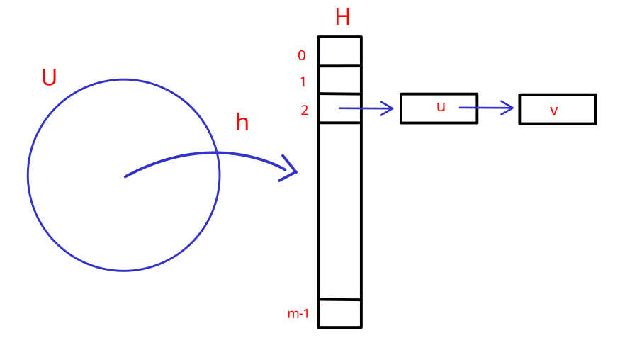

# Hash Table

## Problema del dizionario

Dato un universo $U$ di possibili elementi, dobbiamo mantenere un sott'insieme $S \subseteq U$ soggetto alle seguenti operazioni:

- `make-dictionary()`: crea un dizionario vuoto
- `insert(u)`: aggiungi l'elemento $u \in U$ a $S$
- `delete(u)`: cancella $u$ da $S$ se $u \in S$
- `look-up(u)`: determina se $u$ sta in $S$

Il problema che $U$ può avere una dimensione molto grande, e definire un array di tale dimensione non è efficiente.

**Soluzioni**:

- *Deterministica* - AVL: $O(|S|)$ spazio e $O(log(|S|))$ costo per ogni operazione.
- *Randomizzata* - Hash Tables: $O(|S|)$ spazio e $O(1)$ costo per ogni operazione.

{width="400" style="display: block; margin: 0 auto"}

### Idea

L'idea è quella di tenere in memoria un tabella (array $H$) e ogni $H[i]$ è una linked list di elementi mappati dalla funzione di hash.

Una **collisione** avviene quando, dati due elementi $u \in U$ e $v \in V$ tali che $u \neq v$, e $h(u) = h(v)$.

L'obiettivo è trovare una funzione $h$ di hash tale che rispetti le seguenti caratteristiche:

1. Deterministica: La stessa chiave deve produrre lo stesso indice.
2. Uniforme: Le chiavi devono essere distribuite uniformemente nell'array per minimizzare le collisioni.
3. Veloce da calcolare: Dovrebbe essere computazionalemente efficiente per garantire l'accesso rapido.

- **Fatto I**: Se $|U| > m^2$, per ogni funzione hash $h$ deterministica esiste un insieme $S$ di dimensione $n$ tale che tutti gli elementi di $S$ sono mappati nello stesso slot.
- **Dimostrazione**: Fissato $h$ che dovrà mappare ciascun elemento di $U$ in $H$, e $S$ può essere scelto in modo opportuno dall'"avversario" rispetto ad $h$. Dunque esiste almeno uno slot $i$ di $H$ la cui lista di trabocco ha dimensione $n$. Dunque il costo per ogni operazione è $\theta(n)$

### Randomized Hash Functions

In questo approccio iniziale, si tenta di mappare ogni elemento $u \in S$ a uno slot in $H$ in modo indipendente e uniforme. Questo significa che, per ogni elemento $u$, scegliamo $h(u)$ (il valore hash di $u$) come un numero random tra gli slot disponibili di $H$.

Poiché ogni slot in $H$ ha uguale probabilità di essere scelto, la probabilità che un elemento $u$ venga mappato a uno specifico slot $i$ è data da:
$$Pr[h(u) = i] = \frac{1}{m}$$
dove $m$ è il numero di slot di $H$.

Quando vogliamo fare un'operazione di `insert` o `lookup` per un elemento $u$, generiamo $h(u)$ come un valore random tra gli slot. Tuttavia, dato che $h(u)$ è scelto casualmente ogni volta, non c'è alcuna garanzia che la stessa chiave $u$ venga mappata sempre allo stesso indice.
Di conseguenza, la stessa chiave $u$ potrebbe essere associata a indici diversi in momenti diversi, rendendo difficile trovare dove $u$ sia stato inserito in precedenza.

Per ovviare a questo problema, è necessario memorizzare esplicitamente ogni coppia $(u,\ h(u))$. Così, ogni volta che vogliamo fare una ricerca (`lookup`), possiamo trovare la posizione esatta di $u$ senza dipendere dalla generazione casuale di $h(u)$.

Tuttavia, memorizzare tutte le coppie $(u,\ h(u))$ equivale essenzialmente a tenere traccia di ogni elemento con il proprio valore hash associato, trasformando questo sistema in un dizionario o una mappa in cui ogni chiave ha un valore associato (quindi stiamo cercando di risolvere il problema del dizionraio mediante un dizionari).

!!! success
    Una famiglia $\mathbb{H}$ di funzioni hash si dice **universale** se per ogni $u,\ v \in U\ u \neq v$ la probabilità $\Pr_{h \in \mathbb{H}} [h(u) = h(v)] \leq \frac{1}{m}$

Questo significa che una famiglia di funzioni hash è considerata universale se la probabilità che due elementi distinti $u$ e $v$ dell'universo $U$ vengano mappati allo stesso valore è al più $\frac{1}{m}$ dove $m$ è la dimensione dell'intervallo delle funzioni hash.

!!! success
    **Teorema**: Sia $\mathbb{H}$ una famiglia di funzioni hash universale. Sia $S \subseteq U$ di $n$ elementi. Sia $u \in S$. Scegliamo uniformemente random una funzione $h$ all'interno di $\mathbb{H}$ e sia $X$ una varibiale aleatoria che conta il numero di elementi di $S$ mappati nello slot $h(u)$. Allora $$E[X] = 1 + \frac{n}{m}$$
    **Dimostrazione**: Fissato $u$, per ogni $s \in S$,
    $$
    X_s = \begin{cases}
    1 & \text{se } h(s) = h(u) \\
    0 & \text{altrimenti}
    \end{cases}
    $$
    e $X = \sum_{s \in S} X_s$.
    $$E[X] = E\bigm[\sum_{s \in S} X_s\bigm] = \sum_{s \in S} E[X_s] = \sum_{s \in S} Pr[h(s) = h(u)] = 1 + \sum_{s \in S-\{u\}} Pr[h(s) = h(u)] \leq 1 + \frac{n}{m}$$

**Osservazione**: Il teorema ci dice che, fissato un elemento $u \in S$, il numero atteso di elementi in $S$ mappati nello stesso bucket di $h(u)$ è $E[X] = 1 + \frac{n}{m}$. Questo significa che nel bucket associato a $h(u)$, oltre a $u$ stesso, ci aspettiamo in **MEDIA** $\frac{n}{m}$ altri elementi di $S$.
Conoscendo $n$, possiamo scegliere $m = O(n)$ in modo tale che la dimensione di ciascun bucket sia $\approx O(1)$. In altre parole, **se il numero di bucket è proporzionale al numero di elementi**, ci aspettiamo che ogni bucket contenga in media un numero costante di elementi.

### Una prima famiglia di funzione hash randomizzate

Come progettisti della funzione hash, ci è dato sapere alcune informazioni: $|U| = N$, $|S| = n$. Adesso con queste informazioni dobbiamo determinare la dimensione corretta della Hash Table. Sia $m$ dunque la dimensione della Hash Table, un numero **primo** tale che $n \leq m \leq 2n$, e tale numero $m$ esiste sempre grazie ad un teorema dimostrato da *Chebyshev*.

Il secondo step, è quello di codificare ciascun elemento $x \in U$ come un intero in base $m$, di $r$ cifre, $x = \langle x_1, x_2, \dots, x_r \rangle$. La quantità totale di combinazioni possibili con $r$ cifre è $m^r$. Per garantire che ogni elemento dell'universo possa essere rappresentato senza collisioni, è necessario che il numero totale di combinazioni sia almeno pari al numero di elementi nell'universo, ovvero deve vale che $m^r \geq N$.

$$
m^r \geq N \Rightarrow log(m^r) \geq log(N) \Rightarrow r\ log(m) \geq log(N) \Rightarrow r \geq \frac{log(N)}{log(M)}
$$

Definiamo ora una generica funzione hash della nostra famiglia $\mathbb{H}$. Per ogni $a \in U$ fissato, scriviamo $a$ in $m$-ario, ovvero $a = \langle a_1, a_2, \dots, a_r \rangle$, dove $a_i \in [m]$ per ogni $i = 1, 2, \dots, r$.

$$h_a(x) = \bigm(\sum_{i = 1}^{r} a_i x_i\bigm)\ mod\ m$$

Quindi, la nostra famiglia di funzioni $\mathbb{H} = \{h_a : a \in U\}$. Per memorizzare una singola funzione $h$, necessitiamo di $r = \theta(\frac{log(N)}{log(M)})$ cifre, ciascuna di dimensione $log(m)$.

#### Costo computazionale nel modello RAM

Nel modello **RAM (Random Access Machine)**, supponiamo che ogni operazione aritmetica su parole (addizioni e modulo) richieda $O(1)$ tempo. Questo ci consente di:

- Accedere a ciascun valore $a_i$ e moltiplicarlo per $x_i$ in tempo $O(1)$.
- Sommare i prodotti parziali e fare il modulo $m$, tutto in tempo costante.

Nel modello **RAM**

- **Memorizzare** una funzione $h_a$ richiede $O(1)$ spazio per la stringa $a$.
- **Calcolare** $h_a (x)$ richie $O(1)$ tempo grazie all'accesso e alla manipolazione costante delle parole.

Pertanto, il costo complessivo per memorizzare e computare $h_a(x)$ è molto efficiente e supporta operazioni di hashing rapide nel modello a registri (RAM).

!!! success
    **Teorema**: $\mathbb{H} = \{h_a : a \in U\}$ è universale.
    **Dimostrazione**: Per dimostrare che $\mathbb{H} = \{h_a : a \in U\}$ è universale dobbiamo dimostrare che, presi due elementi $x = (x_1, x_2, \dots, x_r) \in U$ e $y = (y_1, y_2, \dots, y_r) \in U$, tale che $x \neq y$,
    $$Pr[h_a(x) = h_a(y)] \leq \frac{1}{m}$$
    Siccome $x \neq y$, allora $\exists\ j$ intero tale che: $x_j \neq y_j$.
    $$Pr[h_a(x) = h_a(y)] = Pr\bigm[\sum_{i = 1}^r a_i x_i\ mod\ m = \sum_{i = 1}^r a_i y_i\ mod\ m\bigm]$$
    Adesso, da entrambi i termini tiriamo fuori $x_j$ e $y_j$ che per ipotesi sono diversi.
    $$Pr\bigm[a_j(x_j - y_j) = \sum_{i = 1, i \neq j}^r a_i(x_i - y_i)\ mod\ m\bigm]$$
    Per il *Principle Of Deffered Decision*, $\sum_{i = 1, i \neq j}^r a_i(x_i - y_i)\ mod\ m$ è un numero fissato non più una variabile random, dunque l'unica variabile random è $a_j$. La probabilità che valga quell'uguaglianza è $\frac{1}{m}$ in quanto è la probabilità di scegliere $a_j \in [m]$ necessario per rendere verà l'uguaglianza.

    **Conclusione**: $\mathbb{H} = \{h_a : a \in U\}$ è universale in quanto $Pr[h_a(x) = h_a(y)] \leq \frac{1}{m}$.
