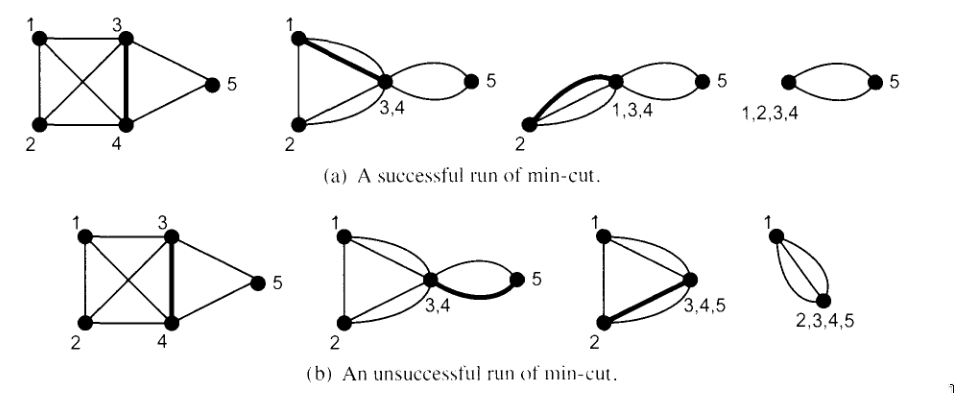

# Algoritmi randomizzati

!!! note
    Gli algoritmi randomizzati sono algoritmi che effettuano decisioni randomiche durante la loro esecuzione. In pratica un algoritmo randomizzato userà valori generati randomicamente per decidere il cosa fare al prossimo step.

Gli algoritmi randomizzati sono più rapidi dei soliti algoritmi deterministici e anche più facili da implementare. Tutto questo però ha un costo: la risposta può avere la probabilità di essere incorretta.

## Applicazione: verificare l'identità di polinomi

Supponiamo di avere due polinomi, $F(x)$ e $G(x)$, dove $F(x)$ è dato come prodotto di fattori e $G(x)$ è dato in forma canonica:

$$[F(x)]:\ (x + 1)(x - 2)(x + 3)(x - 4)(x + 5)(x - 6) \equiv  [G(x)]:\ x^6 - 7x^3 + 25$$

Una soluzione banale è quella di portare $F(x)$ in forma canonica e verificare che i coefficienti delle forme canoniche siano uguali. Però questa soluzione ha un problema, ovvero, se notiamo con $d$ il massimo grado del polinomio, allora, per trasformare $F(x)$ nella sua forma canonica impieghiamo $\theta(d^2)$.

Proviamo adesso ad aggiungere un pò di randomness. L'algoritmo ora sceglie un intero $r$ in modo randomico da un intervallo $\{1, \dots, d100\}$, con distribuzione uniforme, ovvero ogni intero ha probabilità equa di essere scelto. Dopodiché l'algortimo computa $F(r)$ e $G(r)$ in tempo $O(d)$, che è decisamente minore rispetto a $\theta(d^2)$. Infine l'algoritmo decide che $F(x) \equiv G(x)$ se $F(r) = G(x)$ oppure $F(x) \not\equiv G(x)$ se $F(r) \neq G(x)$.

Può però succedere che l'algoritmo dia una risposta sbagliata, analizziamo ora i due casi:

- Se $F(x) \equiv G(x)$ allora l'algoritmo ritorna la risposta corretta per ogni $r$.
- Se $F(x) \equiv G(x)$ e $F(r) \neq G(r)$ allora l'algoritmo ritorna una risposta corretta. Dunque quando l'algoritmo decide che due polinomi sono diversi possiamo essere sicuri che la risposta è sempre corretta.
- Se $F(x) \equiv G(x)$ e $F(r) = G(r)$ allora l' algoritmo ritorna una risposta sbagliata, in altre parole è possibile che l'algortimo decida che due polinomi siano uguali quando in realtà sono divesi. Questo può accadere quando il valore di $r$ corrisponde ad una delle $d$ radici (per il teorema fondamentale dell'algebra, un polinomio di grado $d$ ha al più "d" radici) dell'equazione $F(x) - G(x) = 0$.

Ora però ci resta che analizzare la probabilità di errore dell'algoritmo. Sapendo che $r \in \{1, 2, \dots, 100d\}$ allora $Pr[err] \leq \frac{d}{100d} \leq \frac{1}{100}$, dunque la probabilità di errore è al piu $1\%$.

Possiamo infine ridurre la probabilità di erroe al costo di aumentare il numero di esecuzioni dell'algoritmo sulla stessa istanza (lo vedremo meglio dopo).

L'analisi effettuata fino adesso è stata sì un'analisi probabilistica ma non dal punto di vista matematico. Andiamo ora ad analizzare gli algoritmo randomizzati usando gli assiomi, i teoremi e le proprietà del calcolo probabilistico.

### Alcune nozioni di probabilità (1)

!!! note
    Uno spazio di probabilità è un concetto usato per modellare situazioni in cui si verificano eventi casuali ed è composto da 3 componenti:
    - **Spazio degli eventi $\Omega$**: È l'insieme di tutti i possibili risultati di un esperimento casuale. Ogni singolo risultato è chiamato evento elementare.
    - Una famiglia di insiemi $\mathbb{F}$ di **eventi**, dove ciascun insieme in $\mathbb{F}$ è un sottoinsieme di $\Omega$.
    - Una **funzione di probabilità** $Pr: \mathbb{F} \rightarrow \mathbb{R}$ che assegna a ciascun evento un valore tra 0 e 1, rispettando tre assiomi fondamentali:
      - Per ogni evento $E$, $0 \leq Pr(E) \leq 1$;
      - $Pr(\Omega) = 1$;
      - Per ogni sequenza finita o numerabile infinita di eventi mutualmente disgiunti due a due, $E_1, E_2, E_3, \dots$,
        \[
        Pr(\bigcup_{i=1} E_{i}) = \sum_{i \geq 1} Pr(E_{i})
        \]

### Analisi dell'algoritmo

Usando queste nozioni, possiamo analizzare il nostro algortimo in maniera più formale e precisa. Abbiamo dimostrato che l'unico caso in cui l'algoritmo da una risposta sbagliata è quando $F(x)$ e $G(x)$ non sono equivalenti e l'algoritmo sceglie randomicamente una radice del polinomio differenza.

- Sia $E$ l'evento che rappresenta il fallimento dell'algoritmo nel dare una risposta corretta.
- Gli elementi dell'insieme $E$ sono le radici del polinomio $F(x) - G(x) \in \{1, \dots 100d\}$.
$$Pr(E) \leq \frac{d}{100d} = \frac{1}{100}$$
dove $d$ rappresenta il numero di casi favorevoli e $100d$ il numero di casi possibili.

Dunque l'algoritmo ha una probabilità di errore pari a $1\%$, e dunque sembrerebbe insolito avere un algoritmo che può sbagliare. Negli algoritmi deterministici di solito c'è un tradeoff tra complessità spaziale e complessità temporale. Nell'algoritmo randomizzato che abbiamo visto ci offre un tradeoff tra correttezza e velocità. L'algoritmo ha un precisione dell $99\%$ ma possiamo migliorare questa probabilità?

- Un modo è quello di scegliere $r$ da un insieme di numeri maggiori, per esempio $\{1, \dots, 1000d\}$ così la probabilità di errore è $\leq \frac{1}{1000}$, ma non è sempre possibile fare questa cosa.
- Un altro approccio è di ripetere l' algoritmo molteplici volte sulla stessa istanza sfruttando la proprietà che l'algoritmo ha un **one-sided-error**, ovvero l'algoritmo può sbagliare solo quando decide che i due polinomi sono equivalenti.

Assumiamo di ripetere l'algoritmo $k$ volte.

- Un evento è una sequenza di $k$ scelte $r_1, \dots, r_k$;
- L'insieme dei casi possibili sono tutte le $r$ sequenze nel range $\{1, \dots, 100d\}$;
- La probilità che accada un evento è $(\frac{1}{100d})^k$.
- L'evento **cattivo** corrisponde alla scelta di $k$ radici del polinomio differenza, dunque ci sono al più $d^k$ possibili eventi di questo tipo.
Dunque, la probabilità che accada un **evento cattivo** è $\leq d^k(\frac{1}{100d})^k$.

### Alcune nozioni di probabilità (2)

!!! note
    Due eventi $E$ e $F$ sono **indipendenti** se e soltanto se $Pr(E \cap F) = Pr(E) * Pr(F)$.
    Volendo generalizzare, gli eventi $E_1, E_2, \dots, E_k$ sono mutualmente indipendenti tra di loro se soltanto se per ogni sottoinsieme $I \subset [1, k]$, $$Pr(\bigcap_{i\in I} E_i) = \Pi_{i\in I} Pr(E_i)$$

Dunque, ritornano all'analisi di prima, la probabilità di scegliere una radice singola è $\leq \frac{d}{100d}$, poiché le singole scelte sono **indipendenti** tra loro, otteniamo che, scegliere $k$ radici indipendeti una dopo l'altra ha probabilità $\leq (\frac{d}{100d})^k$.

!!! note
    La probabilità condizionata che si verifichi un evento $E$ sapendo che si è verificato l'evento $F$ è
    $$Pr(E|F) = \frac{Pr(E \cap F)}{Pr(F)}$$
    Ovviamente, la probabilità condizionata è ben definita se soltanto se $Pr(F) > 0$.

Intuitivamente stiamo cercando la probabilità dell'intersezione dei due eventi ($E \cap F$) all'interno dell'insieme dei eventi definiti da $F$. Poiché $F$ definisce definisce il nostro spazio di probabilità ridotto, dobbiamo **normalizzare** la probabilità, dividendo per $Pr(F)$ garantendo che la somma delle probabilità condizionate all'interno di $F$ sia 1.

Alcune identità utili:

- $Pr(A|B) = \frac{Pr(A \cap B)}{Pr(B)}$;
- $Pr(A \cap B) = Pr(A|B)Pr(B)$;
- $Pr(A \cap B \cap C) = Pr(A|B \cap C)Pr(B \cap C) = Pr(A| B \cap C)Pr(B|C)Pr(C)$.

Volendo generalizzare, siano $A_1, \dots, A_n$ una sequenza di eventi. Sia $E_i = \bigcap_{j = 1}^i A_j$, allora
$$Pr(E_n) = Pr(A_n|E_{n-1})Pr(E_{n-1}) = Pr(A_n|E_{n-1})Pr(A_{n-1}|E_{n-2}) \dots Pr(A_2|E_1)Pr(A1)$$

## Applicazione: verifica moltiplicazione tra matrici

Consideriamo ora un'altra applicazione della randomizzazione all'interno degli algoritmi. Supponiamo di avere 3 matrici $n x n$, $A,\ B$ e $C$ con elementi in $\{0, 1\}$. Vogliamo verificare tale uguaglianza: $A * B = C$.
Un algoritmo banale è quello di moltiplicare $A$ e $B$ e verifare poi con $C$. Tale algoritmo richiede tempo $\theta(n^3)$, ridotto a $\theta(n^{2.37})$ usando algoritmi sofisticati. Vogliamo adesso usare un algoritmo randomizzato che ci permette di velocizzare tale operazione.

1. Scegliere un vettore $\vec{r} = (r_1, r_2, \dots, r_n) \in \{0, 1\}^n$;
2. Calcolare $B\vec{r}$;
3. Calcolare $A(B\vec{r})$;
4. Calcolare $C\vec{r}$;
5. if $A(B\vec{r}) \neq C\vec{r}$ return $A*B \neq C$ else return $A * B = C$.

Quest'algoritmo impiega $\theta(n^2)$

Come nell'identità polinomiale, questo algoritmo può sbagliare solo in un caso. Ovviamente se $A*B = C$, l' algoritmo non sbaglia mai. Quindi nel caso in cui l'istanza è SI, la probabilità di errore è pari a 0, dunque siamo di frone ad un algoritmo **one-sided-error**. La situazione in cui potrebbe sbagliare è nel caso in cui $A*B \neq C$, ma $AB\vec{r} = C\vec{r}$, ovvero la proiezione della matrice $A*B$ rispetto alla direzione data da $\vec{r}$ va a finire sulla proiezione della matrice $C$ sulla stessa direzione.

!!! success
    **Teorema**: Se $AB \neq C$ e se il vettore $\vec{r}$ è scelto uniformemente random in $\{0, 1\}^n$, allora
    $$Pr(AB\vec{r} = C\vec{r}) \leq \frac{1}{2}$$

!!! info
    **Lemma**: Scegliere $\vec{r} = (r_1, \dots, r_n) \in \{0, 1\}^n$ uniformemente random è equivalente a scegliere ciascun $r_i$ indipendentemente e uniformemente in $\{0, 1\}$.
    Dunque, la probabilità di scegliere $r_i \in \{0, 1\}$ è pari ad $\frac{1}{2}$, quindi scegliere un vettore $\vec{r}$ di dimensione $n$ ha probabilità pari a $\frac{1}{2^n}$.

Computazionalmente, questo si fa andando a scegliere indipendentemente il bit $r_{i}$ per ciascuna posizione del vettore in modo uniformemente random.

Quando i bit sono scelti in modo indipendente, possiamo usare il **Principle of deferred decision**, che afferma che, anziché prendere tutte le decisioni casuali subito, possiamo prenderle solo quando è necessario farlo. Questo ci permette di mantenere flessibilità durante l'esecuzione e di evitare di prendere decisioni superflue.

Supponiamo di avere una sequenza di bit $r_0, r_1, \dots, r_t$ e di voler valutare la probabilità che lo XOR dei primi $t - 1$ bit sia uguale al $t - esimo$ bit.
$$r_0 \oplus r_1 \oplus r_2 \oplus \dots \oplus r_{t-1} = r_t$$
Quando stiamo scegliendo il $t - esimo$ bit, i primo $t - 1$ sono stati già scelti per il **Principle of deferred decision**, quindi lo XOR dei primo $t - 1$ bit assum un valore fissato (deterministico). Da questo momento in poi possiamo analizzare le probabilità in base al valore di $r_{t - 1}$.

- se $r_{t-1}$ vale 0, allora la probabilità che $r_{t}$ valga 0 è un $\frac{1}{2}$
- se $r_{t-1}$ vale 1, allora la probabilità che $r_{t}$ valga 1 è un $\frac{1}{2}$

In entrambi i casi (che lo XOR dei primi $t − 1$ bit sia 0 o 1), la probabilità che $r_t$​ sia uguale o diverso da quello XOR è sempre $\frac{1}{2}$.​

Dimostriamo ora il teorema precendente:

Sia $D = AB - C \neq 0$, essendo diversi, la differenza non è nulla. Allora $AB\vec{r} = C\vec{r}$ implica che $D\vec{r} = 0$. Siccome $D \neq 0$ allora ci deve essere un qualche valore diverso da 0 all'interno della matrice, assumiamo senza perdità di generalità che tale valore sia $d_{11}$.
Per $D\vec{r} = 0$,
$$\sum_{j = 1}^n d_{1j}r_j$$
oppure sapendo che $d_{11} \neq 0$
$$r_1 = -\frac{\sum_{j=2}^nd_{1j}r_j}{d_{11}}$$

Sapendo che gli $r_1, r_2, \dots, r_n$ sono tutti bit scelti in modo indipendenti con il **Principle of deferred decision** possiamo assumere che gli $r_2, \dots, r_n$ sono fissati e rimane da scegliere in modo random $r_1$.

- se $\frac{\sum_{j=2}^nd_{1j}r_j}{d_{11}}$ vale $0$ allora la probabilità che $r_{11}$ valga $0$ è $\frac{1}{2}$
- se $\frac{\sum_{j=2}^nd_{1j}r_j}{d_{11}}$ vale $1$ allora la probabilità che $r_{11}$ valga $0$ è $0$
- se $\frac{\sum_{j=2}^nd_{1j}r_j}{d_{11}}$ $\neq$ da 0 e 1 allora la probabilità che $r_{11}$ valga $0$ è $0$

Quindi in tutti i casi
$$Pr(r_1 = -\frac{\sum_{j=2}^nd_{1j}r_j}{d_{11}}) \leq \frac{1}{2}$$

Per migliorare la probabilità di errore, esegue l'algoritmo $k$ volte sulla stessa istanza, ottenendo un probabilità $\leq \frac{1}{2^k}$

### Alcune nozioni di probabilità (3)

!!! success
    **Teorema (Legge delle Probabilità Totali)**: Siano $E_1, E_2, \dots, E_n$ eventi mutualmente disgiunti in $\Omega$ tali che $\bigcup_{i=1}^n E_i = \Omega$, allora
    $$Pr(B) = \sum_{i=1}^n Pr(B \cap E_i) = \sum_{i=1}^n Pr(B|E_i)Pr(E_i)$$.

!!! success
    **Teorema (Legge di Bayes)**: Assumiamo che $E_1, E_2, \dots, E_n$ eventi mutualmente disgiunti tali che $\bigcup_{i=1}^n E_i = E$, allora
    $$Pr(E_j|B) = \frac{Pr(E_j \cap B)}{Pr(B)} = \frac{Pr(B|E_j)Pr(E_j)}{\sum_{i=1}^n Pr(B|E_i)Pr(E_i)}$$

## Applicazione: Min-Cut Algorithm

!!! note
    Un **Cut-Set** in un grafo è un insieme di archi la cui rimozione spezza il grafo in due o più componenti connesse. Dato un grafo $G=(V, E)$ con $n$ nodi, il problema del minimo taglio (min-cut) consisite nel trovare il cut-set di cardinalità minima in G.

- **Edge Contraction (Contrazione di un arco)**: È un operazione che permette di semplificare un grafo riducendo il numero di vertici e archi. Quando contrai un arco $(u, v)$, unisci i due vertivi $u$ e $v$ in un unico vertice e gestisci gli archi adiacenti in modo che il grafo risultante mantenga le connessioni rilevanti. Ad ogni contrazione i self loop vengono eliminati.

1. Ripeti per $n - 2$ volte:
   1. Segli un arco uniformemente random
   2. Contrai i 2 nodi connessi da quel arco ed elimina tutti gli archi che collegano i due nodi
2. Ritorna l'insieme di archi che collegano i due 2 nodi rimanenti.

L'algoritmo ogni volta che fa un contrazione di un arco, si deve ricordare i nodi che sono confluiti nel metanodo. Perché poi alla fine dell'algoritmo bisogna ritornare l'insieme degli archi contratti, per cui ha bisogno di ricordare ogni volta qualche arco ha contratto.

{width="600" style="display: block; margin: 0 auto"}

