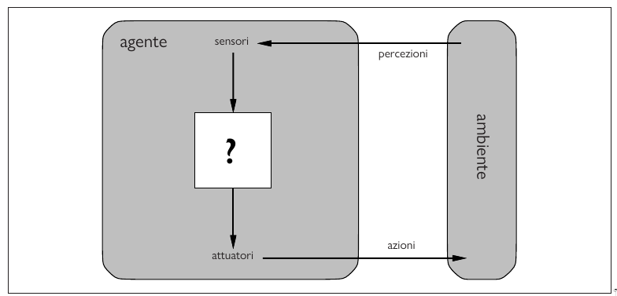
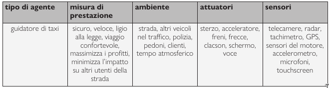
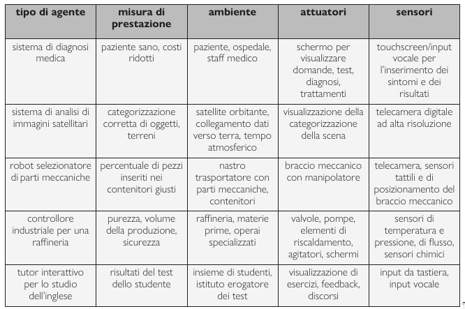
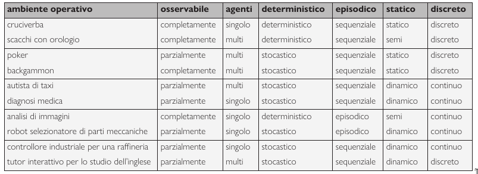
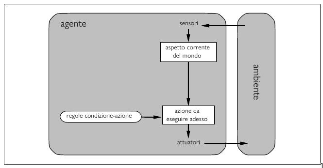
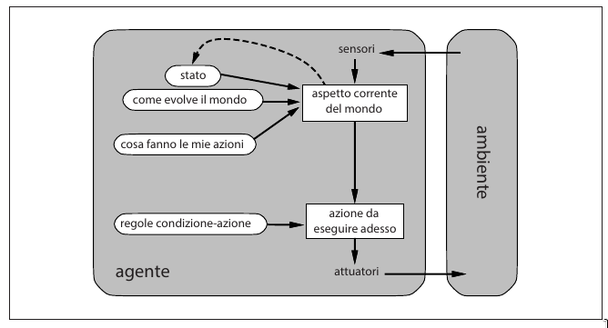
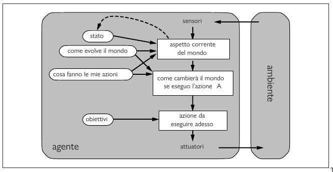
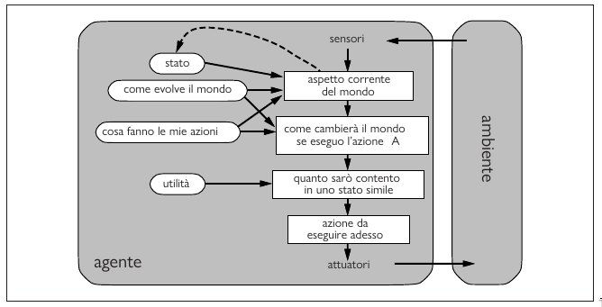

# Capitolo 2 Agenti intelligenti

## 2.1 Agenti e ambienti

Un **agente** è qualsiasi cosa possa essere vista come un sistema che percepisce il suo **ambiente** attraverso dei **sensori** e agisce su di esso mediante **attuatori**.

Un agente software riceve come input(sensori) il contenuto dei file, pacchetti di dati e input umani e può intervenire sull'ambiente scrivendo file, inviando paccehtti di rete e visuallizando informazioni e generando suoni. L'ambiente può essere qualsiasi cosa, virtualmente l'universo intero. Ma nella pratica è soltanto la parte dell'universo di cui ci interessa lo stato quando progettiamo l'agente, ovvero la parte che influenza ciò che l'agente percepisce e sulla quale influiscono le azioni dell'agente.

{width=400px, style="display: block; margin: 0 auto"}

!!! note
    **Percezione**: termine usato per indicare i dati che i sensori di un agente percepiscono. La **sequenza percettiva** fi un agente è la storia completa di tutto ciò che esso ha percepito nella sua esistenza.

*La scelta dell'azione di un agente in un qualsiasi istante può dipendere dalla conoscenza integrata in esso e dall'intera sequenza percettiva osservata fino a quel momento, ma non da qualcosa che l'agente non abbia percepito*. In pratica un agente non può predirre il futuro.

!!! note
    **Funzione agente**: descrive la corrispondeza tra una qualsiasi sequenza percettiva e una specifica azione.
    Internamente, la funzione agente di un agente artificiale sarà implementata da un **programma agente**. Dunque la funzione agente è una descrizione matematica astratta mentre il programma agente è una sua implementazione concreta.

## 2.2 Comportarsi correttamente: il concetto di razionalità

Un **agente razionale** è un agente che fa la cosa giusta, si comporta bene, ma la domanda che ci poniamo è, cosa significa fare la cosa giusta o la cosa sbagliata dal punto di vista di un agente razionale?

### 2.2.1 Misure di prestazione

Il comportamento di un agente è determinato dalle conseguenze delle sue azioni. Questo concetto prende il nome di **consequenzialismo**. In pratica, quando un agente viene inserito in un ambiente, percepisce dai suoi sensori lo stato attuale dell'ambiente e genera una sequenza di azioni, che portano l'ambiente ad attraversare una sequenza di stati. Se tale sequenza di stati è desiderabile, allora significa che l'agente si è comportato bene. Viene poi tutto catturato da una **misura di prestazione** che valuta la sequenza si stati dell'ambiente.

Le macchine, al contrario degli umani non hanno desideri e preferenze, perciò la misura di prestazione, almeno inizialmente sta nella mente del loro progettista o nella mente degli utente a cui la macchina è destinata.

!!! note
    Come regola generale, è meglio progettare le misure di prestazione in base all'effetto che si desidera ottenere sull'ambiente piuttosto che su come si pensa che debba comportarsi l'agente.

Inoltre, quando progettiamo un software destinato a diversi utenti, non possiamo prevedere le esatte preferenze di ogni singolo utente, potrebbe quindi essere necessario costruire agenti in grado di apprenderla con il passare del tempo.

### 2.2.2 Razionalità

!!! note
    **Agente razionale**: Per ogni possibile sequenza di percezioni, un agente razionale dovrebbe scegliere un'azione che massimizzi il valore atteso della sua misura di prestazione, date le informazioni fornite dalla sequenza percettiva e da ogni ulteriore conoscenza dell'agente.

Nei casi in cui la geografia dell'ambiente è sconosciuta, l'agente dovrebbe **esplorarlo**.

### 2.2.3 Onniscenza, apprendimento e autonomia

Bisogna distinguere il concetto di razionalità a quello di **onniscenza**. Un agente onniscente conosce il risultato effettivo delle sue azioni e può agire di conseguenza, ma nella realtà l'onniscenza è impossibile.
La razionalità massimizza il risultato *atteso*, mentre la perfezione massimizza quello *reale*.

La definizione di razionalità non richiede quindi l'onniscenza, perché la scelta razionale dipende solo dalla sequenza percettiva *fino al momento corrente*.

Intraprendere azioni *mirate a modificare le percezioni future*, (**information gathering**), è una parte importante della razionalità. Un secondo esempio di information gathering è rappresentato dall'**esplorazione**.

LA definizione richiede che un agente razionale sia anche in grado di **apprendere** il più possibile sulla base delle proprie percezioni.

Quando un agente si appoggia alla conoscenza pregressa fornita dal pregettista invece che alle proprie percezioni e ai suoi processi di apprendimento, diciamo che manca di **autonomia**. Un agente razionale dovrebbe essere autonomo e apprendere il più possibile per compensare la presenza di conoscenza parziale o erronea.

Dopo aver accomulato una sufficiente esperienza in una dato ambiente, il comportamento dell'agente razionale può diventare a tutti gli effetti *indipendente* dalla conoscenza pregressa. Incorporare l'apprendimento nel suo progetto, quindi, permette di sviluppare un agente razionale capace di operare efficacemente in una grande varietà di ambienti differenti.

## 2.3 La natura degli ambienti

!!! note
    **Ambienti operativi**: sono essenzialmente i "problemi" di cui gli agenti razionali rappresentano le "soluzioni"

### 2.3.1 Specificare un ambiente

QUando si progetta un agente, si devono specificare: la misura di prestazione, l'ambiente eseterno, gli attuatori e i sensori dell'agente. Possiamo riassumere queste cose con il termine **amnbiente operativo** oppure **PEAS** (Performance, Environment, Actuators, Sensors). Questa specificia dell'ambiente operativo deve essere più ricca possibile quando si progetta un agente.

!!! example
    Un autista automatico per taxi:
    {width=400px, style="display: block; margin: 0 auto"}

{width=400px, style="display: block; margin: 0 auto"}

Notiamo che alcuni ambienti virtuali possono essere complessi quanto quelli "reali": per esempio, un **agente software** che opera su siti web di aste e di commercio al dettaglio deve avere a che fare con milioni di altri utenti e miliardi di oggetti, alcuni con immagini reali.

### 2.3.2 Proprietà degli ambienti operativi

- **Completamente osservabile/parzialmente osservabile**: Se i sensori di un agente gli danno accesso allo stato completo dell'ambiente in ogni momento, allora diciamo che l'ambiente operativo è *completamente osservabile*. Un ambiente potrebbe essere *parzialmente osservabile* a causa di sensori inaccurati o per la presenza di rumore, o semplicemente perché una parte dei dati non viene rilevata dai sensori. Se l'agente non dispone di sensori, l'ambiente è **inosservabile**.
- **Agente singolo/multiagente**: Inanzitutto una la distinzione banale tra agente singolo e multiagente è: un agente che da solo risolve un cruciverba opera in un ambiente ad agente singolo mentre un agente che gioca a scacchi si trova in un ambiete a due agenti, quindi multiagente. La distinzione è pero più sottile, perche fino adesso abbiamo descritto in ce modo un'entità *può* essere vista come agente ma non quali *devono* essere considerate tali. Un agente A deve considerare l'oggetto B come un agente, oppure lo può trattare come un semplice oggetto? La distinzione chiave è che si può descrivere il comportamento di B come *il tentativo di massimizzare una misura di prestazione il cui valore dipende dal comportamento di A*. Gli scacchi quindi sono un ambiente multiagente **competitivo**, mentre nell'ambiente dei taxi possiamo dire che è un ambiente multiagente **cooperativo**.
- **Deterministico/non deterministico**: Se lo stato successivo dell'ambiente è completamente determinato dallo stato corrente e dall'azione eseguita dall'agente, allora si può dire che l'ambiente è deterministivo, in caso contrario si dice che è non deterministico. Un esempio di ambiente non deterministico è la guida di un taxi che è chiaramente una situazione non deterministica, perché nessuno può prevedere un esattamente l'andamento del traffico. Si usa anche il termine **stocastico** come sinonimo di non determinismo. Diciamo però che un ambiente è stocastico se è esplicitamente associato a probabilità e non deterministivo se le varie probabilità sono elencate senza essere quantificate.
- **Episodico/sequenziale**: in un ambiente operativo episodico, l'esperienza dell'agente è divisa in episodi atomici. In ogni episodio l'agente riceve una percezione e poi esegue una singola azione che è indipendente da quelle precedenti. Per esempio le attività di classifica sono episodiche. Negli ambienti sequenziali, al contrariom ogni decisione può influenzare tutte quelle successive, tipo nel gioco degli scacchi.
- **Statico/Dinamico**: Se l'ambiente può cambiare mentre un agente sta decidendo come agire, allora diciamo che è dinamico (*guida taxi*) per quell'agente: in caso contrario diciamo che è statico (*cruciverba*). Gli ambienti statici sono più facili da trattare in quanto non cambiano mentre quelli dinamici chiedono continuamente all'agente quello che vuole fare. Invece diciamo che l'ambiente è **semidinamico** se l'ambiente stesso non cambia al passare del tempo, ma la valutazione della prestazione dell'agente (*scacchi*).
- **Discreto/continuo**: La distinzione tra discreto e continuo si applica allo *stato* dell'ambiente, al modo in cui è gestito il *tempo*, alle *percezioni* e *azioni* dell'agente. Gli scacchi sono un ambiente discreto mentre la guida di un taxi continuo.
- **Noto/ignoto**: Questa distinzione si riferisce allo stato di conoscenza dell'agente circa le "leggi fisiche" dell'ambiente. In un ambiente noto, sono conosciuti i risultati per tutte le azioni. In un ambiente ingnoto, l'agente dovrà apprendere come funziona per poter prendere buone decisioni.

{width=400px, style="display: block; margin: 0 auto"}

## 2.4 La struttura degli agenti

Come sono strutturati internamente gli agenti? Il compito dell'AI è progettare il **programma agente** che implementa la funzione agente che fa corrispondere le percezioni alle azioni. Questo programma sarà eseguito su un dispositivo che prende il nome di architettura agente.
`agente = architettura + programma`

### 2.4.1 Programmi agenti

La sfida principale dell'IA sta nel trovare il modo di scrivere programmi che, nella massima misura possibile, producano un comportamento razionale con una piccola quantità di codice anziché con un'enorme tabella.

### 2.4.2 Agenti reattivi semplici

È il tipo di agente più semplice. Gli **agenti reattvi semplici** scelgono le azioni sulla base della percezione *corrente*, ignorando tutta la storia percettiva precedente.

La connessione tra percezione e azione prende il nome di **regola condizione-azione**, e sono regole `if condizione then azione`.

{width=400px, style="display: block; margin: 0 auto"}

```javascript
function AGENTE-REATTIVO-SEMPLICE(percezione) return azione
    persistent: regole, un insieme di recole condizione-azione
    stato = INTERPRETA-INPUT(percezione)
    regola = REGOLA-CORRISPONDENTE(stato, regole)
    azione = regola.AZIONE
    return azione
```

L'agente reattivo semplice funziona *solo se si può selezionare selezionare la decisione corretta in base alal sola percezione corrente, ovvero solo nel caso in cui l'ambiente sia completamente osservabile*.
Spesso gli agenti reattivi semplici non sono in grado di evitare cicli infiniti quando operano in ambienti parzialmente osservabili. Evitare i cicli infiniti è possibile quando l'agente è in gradi di **randomizzare** le sue azioni, scegliendone una in modo casuale.

### 2.4.3 Agenti reattivi basati su modello

Il modo più efficace di gestire l'osservabilità parziale, per un agente, è *tener traccia della parte del mondo che non può vedere nell'istante corrente*. Dunque l'agente deve mantenere uno **stato interno** che dipende dalla storia delle percezioni e riflette almeno una parte degli aspetti non osservabili dello stato corrente.

Aggiornare l'informazione dello stato interno al passaggio del tempo richiede di avere informazioni sull'evoluzione del mondo nel tempo (**modello di transizione**) e informazioni su come lo stato del mondo si rifletta nelle percezione dell'agente (**modello sensoriale**).

Il modello transizionale e il modello sensoriale, insieme, consentono a un agente di tenere traccia dello stato del mondo, e tali agenti prendono il nome di **agente basato su modello**.

{width=400px, style="display: block; margin: 0 auto"}

```javascript
function AGENTE-REATTIVO-BASATO-SU-MODELLO(percezione) returns azione
    persistent: stato, la concezione corrente dello stato dell'agente
        modello_transizione, una descrizione di come lo stato del mondo attuale è riflesso nelle percezioni dell'agente
        regole, un insieme di regole condizione-azione
        azione, l'azione più recente, inizialmente nessuna

    stato = AGGIORNA-STATO(stato, azione, percezione, modello_transizione, modello_sensoriale)
    regola = REGOLA-CORRISPONDENE(stato, regole)
    azione = regola.AZIONE
    return azione
```

I dettagli della rappresentazione di modelli a stati variano in base al tipo di ambiente e alla particolare tecnologia utilizzata nella progettazione dell'agente. Indipendentemente dal tipo di rappresentazione utilizzato, talvolta l'agente ha la possibilità di determinare con *esattezza* lo stato corrente di un ambiente parzialmente osservabile.

### 2.4.4 Agenti basati su obiettivi

Oltre a sapere la descrizione dello stato interno, l'agente ha bisogno di qualche tipo di informazione riguardante il suo **obiettivo (goal)**, che descriva situazioni desiderabili, come per esempio raggiungere una particolare destinazione.

Spesso scegliere un'azione in base a un obiettivo è molto semplice, quando questo però può essere raggiunto in un solo passo. Mentre è più difficile quando l'agente deve considerare una sequenza di azioni per arrivare al risultato desiderato.
Queste sequenze sono identificate mediante tecnice di **ricerca** e **pianificazione**.

{width=400px, style="display: block; margin: 0 auto"}

### 2.4.5 Agenti basati sull'utilità

Gli obiettivi forniscono solamente una distinzione binaria tra stati "contenti" e "scontenti". C'è invece bisogno di una misura di prestazione più generale che dovrebbe permettere di confrontare stati del mondo differenti e misurare precisamente la contentezza, che prende nome di **utilità**.

Una **funzione di utilità** di un agente è, in sostanza, un'internalizzazione della misura di prestazione. Dunque l'agente la funzione di utilità è una formalizzazione del concetto di misura di prestazione, in cui l'agente assegna un valore numerico a ogni possibile stato del mondo o azione, riflettendo quanto "utile" o "desiderabile" quell'azione o stato sia per lui.

Un agente basato sull'utilità sceglie l'azione che massimizza l'**utilità attesa** dei risultanti, ovvero l'utilità che l'agente si attende di ottenere, in media, date le probabilità e le utilità di ciascun risultato.

{width=400px, style="display: block; margin: 0 auto"}

### 2.4.6 Agenti capaci di apprendere
