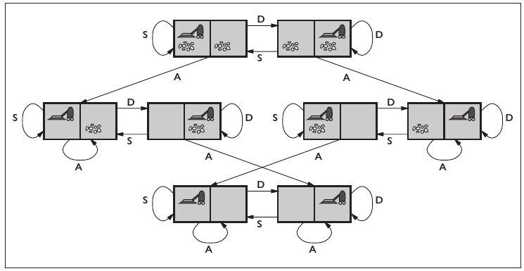
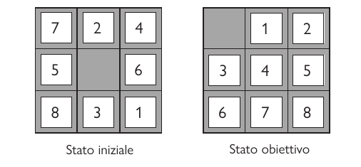
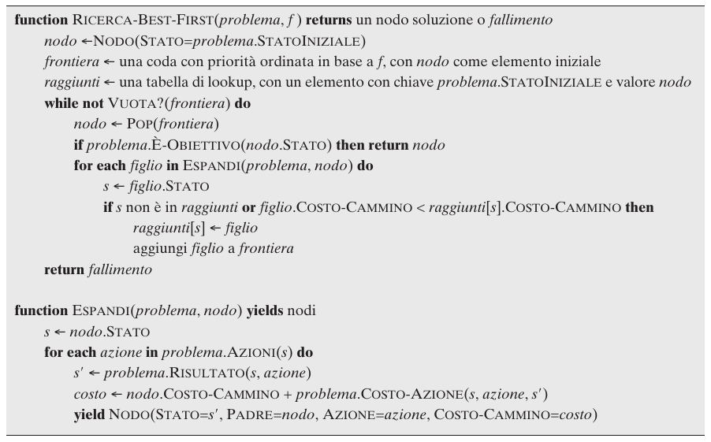

# Capitolo 3 Risolvere i problemi con la ricerca

Un **agente risolutore di problemi** è un agente che ha la necessità di guardare avanti, ovvero di considerare una sequenza di azioni che formano un cammino che porterà a uno stato obiettivo. Tale processo prende il nome di **ricerca**.

Tali agenti utilizzano rappresentazioni **atomiche** in cui gli stati del mondo sono considerati come entità prive di una struttura interna visibile agli algoritmi per la risoluzione dei problemi. Ci sono invece gli **agenti pianificatori** che utilizzano rappresentazioni degli stati **fattorizzate** o **strutturate**.

L'ambiente che andiamo a considerare è: episodico, a singolo agente, completamente osservabile, deterministico, statico, discreto e noto.

Ci sono 2 categorie di algoritmi:

- **Informati**: in cui l'agente è in grado di stimare la distanza dall'obiettivo.
- **Non Informati**: in cui l'agente non è in grade di fare tale stima.

## 3.1 Agenti risolutori di problemi

Avendo una visione completa sull'ambiente, l'agente è in grado di accedere a informazioni sul mondo. Con tali informazioni a disposizione, l'agente può eseguire un processo di risoluzione del problema in 4 fasi.

- **Formulazione dell'obiettivo**: l'agente adotta degli **obiettivi**, che aiutano ad organizzare il comportamento limitando gli scopi e quindi le azioni da considerare.
- **Formulazione del problema**: l'agente elabora una descrizione degli stati e delle azioni necessarie per raggiungere l'obiettivo, ovvero un modello astratto della parte del mondo interessata.
- **Ricerca**: l'agente effettua delle simulazione del suo mondo astratto, continuando a cercare una **soluzione** ovvero una sequenza che raggiunge l'obiettivo.
- **Esecuzione**: ora l'agente effettua nel mondo reale la sequenza di azioni specificata nella soluzione.

### 3.1.2 Problemi di ricerca e soluzioni

Un **problema** di ricerca può essere definito come:

- Un insieme di **stati** in cui può trovarsi l'ambiente detto **spazione degli stati**.
- **Stato iniziale** in cui si trova l'agente inizialemente.
- Un insieme di **stati obiettivo**.
- **Azioni** possibili dell'agente. Dato un stato $s$, $AZIONI(s)$ restituisce un insieme finito di azioni che possono essere eeguite (**applicabile**) in  $s$.
- Un **modello di transizione** che descrive ciò che fa ogni azione, $RISULTATO(s, a)$ restituisce lo stato risultante dall'esecuzione dell'azione $a$ nello stato $s$.
- Una **funzione di costo dell'azione**, $COSTO-AZIONE(s, a, s')$ che restituisce il costo numerico di applicare l'azione $a$ nello stato $s$ per raggiungere lo stato $s'$.

Una sequenza di azioni forma un **cammino**; una **soluzione** è un cammino che porta dallo stato iniziale a uno stato obiettivo. Assumiamo che i costi delle azioni siano additivi, e che il costo dell'cammino sia la somma dei costi delle singole azioni. Una **soluzione ottima** è quella di costo minimo.

Lo spazio degli stati può essere rappresentato come un **grafo** i cui nodi rappresentano gli stati e gli archi rappresentano le azioni.

### 3.1.2 La formulazione dei problemi

Per formulare il problema serve un buon livello di **astrazione**, quindi serve trovare un buon livello di astrazione per poter creare poi un **modello astratto** del probelma reale.

## 3.2 Problemi esemplificativi

- **Problema standardizzato**: ha lo scopo di illustrare o mettere alla prova diversi metodi di risoluzione dei problemi, può essere descritto in modo preciso e sintattico ed è spesso utilizzato come benchmark per confrontare le prestazioni degli algoritmi.
- **Problema del mondo reale**: per esempio la navigazione di un robot è un problema le cui soluzioni sono utili alle persone e la formalizzazione non è stardadizzata ma specifica.

### 3.2.1 Problemi stardadizzati

Andiamo ora a vedere alcuni problemi **su griglia**, ovvero il mondo è una matrice bidimensionale costituida da celle su gli agenti possono muoversi.

#### Formulazione problema dell'aspirapolvere

{width=400px, style="display: block; margin: 0 auto"}

- **Stati**: Uno stato indica quali oggetti sono in quali celle. In questo caso gli oggetti sono l'agente e lo sporco.
- **Stato iniziale**: Qualsiasi stato può essere uno stato iniziale.
- **Azioni**: *Destra*, *Sinistra*, *Su*, *Giù*, *Aspira*.
- **Modello di transizione**: *Aspira* rimuove lo sporco dalla cella in cui si trova, *Destra* lo sposta di un cella a destra e cosi via.
- **Stato obiettivo**: gli stati in cui ogni cella è pulita.
- **Costo di azione**: ogni azione costa 1.

### Formulazione puzzle dell'otto

{width=400px, style="display: block; margin: 0 auto"}

In un **puzzle a tasselli mobili**, un certo numero di tasselli sono disposti in una griglia con uno o più spazi vuoti in modo tale che qualcuno dei tasselli possa scorrere in uno spazio vuoto.

- **Stati**: Possibili configuazione della griglia.
- **Azioni**: *Destra*, *Sinistra*, *Su*, *Giù*.
- **Modello di transizione**: Fa corrispondere a uno stato e un'azione lo stato risultante.
- **Stato obiettivo**: Una configurazione con i numeri ordinati.
- **Costo di azione**: ogni azione costa 1.

## 3.3 Algoritmi di ricerca

Un **algoritmo di ricerca** riceve in input un problema di ricerca e restituisce una soluzione o un'indicazione di fallimento. Un **albero di ricerca** rispetto un grafo dello spazio degli stati rappresenta tutti i cammini a partire dallo stato iniziale fino a raggiungre lo stato obiettivo. Ciascun **nodo** nell'albero di ricerca corrisponde a uno stato nello spazio degli stati e i rami dell'albero di ricerca corrispondono ad azioni. La radice dell'albero corrisponde allo stato iniziale del problema. Una volta ottenuto l'albero di ricerca, possiamo effettuare una visita su di esso, andando a **espandere** ciascun nodo, considerando le *AZIONI* disponibili per quello stato, usando una funzione *RISULTATO* per vedere dove portano tali azioni e *generare* un nuovo nodo. Ogni nodo ha un nodo **padre** (tranne per la root) e un nodo **figlio** (tranne per le foglie).

Chiamiamo l'insieme dei nodi figli da considerare come nodi di **frontiera** dell'albero della ricerca e diciamo che ogni stato per cui vi è un nodo generato è stato **raggiunto**. Notiamo che la frontiera **separa** due regioni del grafo dello spazio degli stati: una regione interna in cui ogni stato è stato espanso e una esterna di stati che non sono ancora stati raggiunti.

### 3.3.1 Ricerca best-first

Ora dobbiamo capire come scegliere il nodo sulla frontiere. Un approccio molto generale è quello della **ricerca best-first**, in cui scegliamo un nodo $n$ che corrisponde al valore di una **funzione di valutazione** $f(n)$.

{width=400px, style="display: block; margin: 0 auto"}

Ad ogni iterazione scegliamo un nodo sulla frontiera in cui $f(n)$ ha valore minimo e lo restituiamo se il suo stato è uno stato obiettivo, altrimenti applichiamo $ESPANDI$ per generare nodi figli. Alla fine l'algoritmo restiuisce o un indicazione di fallimento oppure un nodo che rappresenta un cammino che porta a un obiettivo.

### 3.3.2 Strutture dati per la ricerca

Un **nodo** nell'albero di ricerca è rappresentato da una struttura dati con 4 componenti:

1. `n.STATO`: lo stato a cui corrisponde il nodo;
2. `n.PADRE`: il nodo dell'albero di ricerca che ha generato il nodo corrente;
3. `n.AZIONE`: l'azione applicata allo stato del padre per generare il nodo corrente;
4. `n.COSTO-CAMMINO`: il costo totale del cammino che va dallo stato iniziale al nodo corrente.

Ora però ci serve una struttura dati per memorizzare la **frontiera**, la scelta più appropriatà è una **coda**.

Altre stutture usate per memorizzare la frontiera:

- **Coda con priorità**: in cui viene estratto prima il nodo di costo minimo in base a una funzione di valutazione $f$ (è usata nella ricerca best-first).
- **Coda FIFO**: in cui viene estratto prima il nodo che è stato aggiunto alla coda per primo (è usata nella BFS).
- **Coda LIFO (Stack/Pila)**: in cui viene estratto il nodo che è stato aggiunto per ultimo (è usata nella DFS).

### 3.3.3 Cammini ridondanti

Diciamo che un stato è **ripetuto** nell'albero di ricerca se è generato da un **ciclo (cammino ciclico)**. Un ciclo è un particolare **cammnino ridondante**. Dunque il problema adesso è la possibilità di avere cammini ridondanti e dunque che l'algoritmo generi infiniti stati, ripetendoli. Ci sono 3 approcci a questo problema:

- Ricordare tutti gli stati precedentemente raggiunti.
- Non preoccuparsi di ripetere il passato, ci sono problemi in cui è raro o impossibile che due cammini conducano allo stesso stato. Un algoritmo di ricerca è detto di **ricerca su grafo** se controlla la presenza di cammini ridondanti e **ricerca ad albero** se non esegue tale controllo.
- Controlliamo la presenza di cammini ciclici, ma non di cammini ridondanti.

### 3.3.4 Misurare le prestazioni nella risoluzione di problemi

Possiamo valutare le prestazioni di un algoritmo secondo quattro parametri.

- **Completezza**
- **Ottimalità rispetto al costo**
- **Complessità temporale**
- **Complessità spaziale**

Un algoritmo per essere completo deve procedere in modo **sistematico** nell'esplorazione di uno spazio degli stati infiniti, assicurandosi di poter raggiungere qualsiasi stato collegato a quello iniziale.

La complessità spaziale e quella temporale sono sempre considerate in rapporto a una misura della difficoltà del problema. Nell'informatica teorica tale misura è la dimensione del grafo in input, quindi $\bigm|V\bigm| + \bigm|E\bigm|$. Questo è appropriato quando il grafo è una struttura dati esplicita, come una mappa. Tuttavia, in molti problemi di IA il grafo è rappresentato soltanto *implicitamente* dallo stato iniziale, dalle azioni e dal modello di transizione. Per uno spazio degli stati implicito, la complessità si può misurare in termini di $d$, **profondità (depth)** ovvero il numero di azioni di una soluzione ottima, e $b$, **fattore di ramificazione (branching-factor)** o numero di successori di un nodo che devono essere considerati.

## 3.4 Stategie di ricerca informata

In un algoritmo di ricerca non informata (come la ricerca in ampiezza o la ricerca in profondità), l'agente non ha informazioni aggiuntive sulla distanza di uno stato dall'obiettivo. Pertanto, si basa esclusivamente sulla struttura dello spazio di ricerca e non ha modo di valutare quale azione porti più vicino alla soluzione.

Questo implica che l'agente esplora lo spazio in modo "cieco", ovvero seguendo una strategia di esplorazione basata solo sulla struttura, senza sapere se sta facendo progressi. Di conseguenza, l'efficienza di questi algoritmi può essere bassa, specialmente su spazi di ricerca ampi o complessi, poiché potenzialmente esplorano molti stati non rilevanti prima di trovare la soluzione.

### 3.4.1 Ricerca in ampiezza

Quando tutte le azioni hanno lo stesso costo, una strategia appropriata è la **ricerca in ampiezza (BFS)**, in cui si espande prima il nodo radice, poi tutti i suoi successori e cosi via. Potremmo implementare la ricerca in ampiezza come chiamata di `RICERCA-BEST-FIRST` con la funzione di valutazione $f(n)$ uguale alla profondità del nodo, cioè al numero di azioni necessario per raggiungerlo.