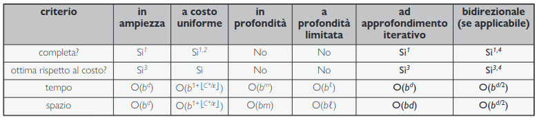

# Capitolo 3 Risolvere i problemi con la ricerca

Un **agente risolutore di problemi** è un agente che ha la necessità di guardare avanti, ovvero di considerare una sequenza di azioni che formano un cammino che porterà a uno stato obiettivo. Tale processo prende il nome di **ricerca**.

Tali agenti utilizzano rappresentazioni **atomiche** in cui gli stati del mondo sono considerati come entità prive di una struttura interna visibile agli algoritmi per la risoluzione dei problemi. Ci sono invece gli **agenti pianificatori** che utilizzano rappresentazioni degli stati **fattorizzate** o **strutturate**.

L'ambiente che andiamo a considerare è: episodico, a singolo agente, completamente osservabile, deterministico, statico, discreto e noto.

Ci sono 2 categorie di algoritmi:

- **Informati**: in cui l'agente è in grado di stimare la distanza dall'obiettivo.
- **Non Informati**: in cui l'agente non è in grade di fare tale stima.

## 3.1 Agenti risolutori di problemi

Avendo una visione completa sull'ambiente, l'agente è in grado di accedere a informazioni sul mondo. Con tali informazioni a disposizione, l'agente può eseguire un processo di risoluzione del problema in 4 fasi.

- **Formulazione dell'obiettivo**: l'agente adotta degli **obiettivi**, che aiutano ad organizzare il comportamento limitando gli scopi e quindi le azioni da considerare.
- **Formulazione del problema**: l'agente elabora una descrizione degli stati e delle azioni necessarie per raggiungere l'obiettivo, ovvero un modello astratto della parte del mondo interessata.
- **Ricerca**: l'agente effettua delle simulazione del suo mondo astratto, continuando a cercare una **soluzione** ovvero una sequenza che raggiunge l'obiettivo.
- **Esecuzione**: ora l'agente effettua nel mondo reale la sequenza di azioni specificata nella soluzione.

### 3.1.2 Problemi di ricerca e soluzioni

Un **problema** di ricerca può essere definito come:

- Un insieme di **stati** in cui può trovarsi l'ambiente detto **spazione degli stati**.
- **Stato iniziale** in cui si trova l'agente inizialemente.
- Un insieme di **stati obiettivo**.
- **Azioni** possibili dell'agente. Dato un stato $s$, $AZIONI(s)$ restituisce un insieme finito di azioni che possono essere eeguite (**applicabile**) in  $s$.
- Un **modello di transizione** che descrive ciò che fa ogni azione, $RISULTATO(s, a)$ restituisce lo stato risultante dall'esecuzione dell'azione $a$ nello stato $s$.
- Una **funzione di costo dell'azione**, $COSTO-AZIONE(s, a, s')$ che restituisce il costo numerico di applicare l'azione $a$ nello stato $s$ per raggiungere lo stato $s'$.

Una sequenza di azioni forma un **cammino**; una **soluzione** è un cammino che porta dallo stato iniziale a uno stato obiettivo. Assumiamo che i costi delle azioni siano additivi, e che il costo dell'cammino sia la somma dei costi delle singole azioni. Una **soluzione ottima** è quella di costo minimo.

Lo spazio degli stati può essere rappresentato come un **grafo** i cui nodi rappresentano gli stati e gli archi rappresentano le azioni.

### 3.1.2 La formulazione dei problemi

Per formulare il problema serve un buon livello di **astrazione**, quindi serve trovare un buon livello di astrazione per poter creare poi un **modello astratto** del probelma reale.

## 3.2 Problemi esemplificativi

- **Problema standardizzato**: ha lo scopo di illustrare o mettere alla prova diversi metodi di risoluzione dei problemi, può essere descritto in modo preciso e sintattico ed è spesso utilizzato come benchmark per confrontare le prestazioni degli algoritmi.
- **Problema del mondo reale**: per esempio la navigazione di un robot è un problema le cui soluzioni sono utili alle persone e la formalizzazione non è stardadizzata ma specifica.

### 3.2.1 Problemi stardadizzati

Andiamo ora a vedere alcuni problemi **su griglia**, ovvero il mondo è una matrice bidimensionale costituida da celle su gli agenti possono muoversi.

#### Formulazione problema dell'aspirapolvere

{width=400px, style="display: block; margin: 0 auto"}

- **Stati**: Uno stato indica quali oggetti sono in quali celle. In questo caso gli oggetti sono l'agente e lo sporco.
- **Stato iniziale**: Qualsiasi stato può essere uno stato iniziale.
- **Azioni**: *Destra*, *Sinistra*, *Su*, *Giù*, *Aspira*.
- **Modello di transizione**: *Aspira* rimuove lo sporco dalla cella in cui si trova, *Destra* lo sposta di un cella a destra e cosi via.
- **Stato obiettivo**: gli stati in cui ogni cella è pulita.
- **Costo di azione**: ogni azione costa 1.

### Formulazione puzzle dell'otto

{width=400px, style="display: block; margin: 0 auto"}

In un **puzzle a tasselli mobili**, un certo numero di tasselli sono disposti in una griglia con uno o più spazi vuoti in modo tale che qualcuno dei tasselli possa scorrere in uno spazio vuoto.

- **Stati**: Possibili configuazione della griglia.
- **Azioni**: *Destra*, *Sinistra*, *Su*, *Giù*.
- **Modello di transizione**: Fa corrispondere a uno stato e un'azione lo stato risultante.
- **Stato obiettivo**: Una configurazione con i numeri ordinati.
- **Costo di azione**: ogni azione costa 1.

## 3.3 Algoritmi di ricerca

Un **algoritmo di ricerca** riceve in input un problema di ricerca e restituisce una soluzione o un'indicazione di fallimento. Un **albero di ricerca** rispetto un grafo dello spazio degli stati rappresenta tutti i cammini a partire dallo stato iniziale fino a raggiungre lo stato obiettivo. Ciascun **nodo** nell'albero di ricerca corrisponde a uno stato nello spazio degli stati e i rami dell'albero di ricerca corrispondono ad azioni. La radice dell'albero corrisponde allo stato iniziale del problema. Una volta ottenuto l'albero di ricerca, possiamo effettuare una visita su di esso, andando a **espandere** ciascun nodo, considerando le *AZIONI* disponibili per quello stato, usando una funzione *RISULTATO* per vedere dove portano tali azioni e *generare* un nuovo nodo. Ogni nodo ha un nodo **padre** (tranne per la root) e un nodo **figlio** (tranne per le foglie).

Chiamiamo l'insieme dei nodi figli da considerare come nodi di **frontiera** dell'albero della ricerca e diciamo che ogni stato per cui vi è un nodo generato è stato **raggiunto**. Notiamo che la frontiera **separa** due regioni del grafo dello spazio degli stati: una regione interna in cui ogni stato è stato espanso e una esterna di stati che non sono ancora stati raggiunti.

### 3.3.1 Ricerca best-first

Ora dobbiamo capire come scegliere il nodo sulla frontiere. Un approccio molto generale è quello della **ricerca best-first**, in cui scegliamo un nodo $n$ che corrisponde al valore di una **funzione di valutazione** $f(n)$.

{width=400px, style="display: block; margin: 0 auto"}

Ad ogni iterazione scegliamo un nodo sulla frontiera in cui $f(n)$ ha valore minimo e lo restituiamo se il suo stato è uno stato obiettivo, altrimenti applichiamo $ESPANDI$ per generare nodi figli. Alla fine l'algoritmo restiuisce o un indicazione di fallimento oppure un nodo che rappresenta un cammino che porta a un obiettivo.

### 3.3.2 Strutture dati per la ricerca

Un **nodo** nell'albero di ricerca è rappresentato da una struttura dati con 4 componenti:

1. `n.STATO`: lo stato a cui corrisponde il nodo;
2. `n.PADRE`: il nodo dell'albero di ricerca che ha generato il nodo corrente;
3. `n.AZIONE`: l'azione applicata allo stato del padre per generare il nodo corrente;
4. `n.COSTO-CAMMINO`: il costo totale del cammino che va dallo stato iniziale al nodo corrente.

Ora però ci serve una struttura dati per memorizzare la **frontiera**, la scelta più appropriatà è una **coda**.

Altre stutture usate per memorizzare la frontiera:

- **Coda con priorità**: in cui viene estratto prima il nodo di costo minimo in base a una funzione di valutazione $f$ (è usata nella ricerca best-first).
- **Coda FIFO**: in cui viene estratto prima il nodo che è stato aggiunto alla coda per primo (è usata nella BFS).
- **Coda LIFO (Stack/Pila)**: in cui viene estratto il nodo che è stato aggiunto per ultimo (è usata nella DFS).

### 3.3.3 Cammini ridondanti

Diciamo che un stato è **ripetuto** nell'albero di ricerca se è generato da un **ciclo (cammino ciclico)**. Un ciclo è un particolare **cammnino ridondante**. Dunque il problema adesso è la possibilità di avere cammini ridondanti e dunque che l'algoritmo generi infiniti stati, ripetendoli. Ci sono 3 approcci a questo problema:

- Ricordare tutti gli stati precedentemente raggiunti.
- Non preoccuparsi di ripetere il passato, ci sono problemi in cui è raro o impossibile che due cammini conducano allo stesso stato. Un algoritmo di ricerca è detto di **ricerca su grafo** se controlla la presenza di cammini ridondanti e **ricerca ad albero** se non esegue tale controllo.
- Controlliamo la presenza di cammini ciclici, ma non di cammini ridondanti.

### 3.3.4 Misurare le prestazioni nella risoluzione di problemi

Possiamo valutare le prestazioni di un algoritmo secondo quattro parametri.

- **Completezza**
- **Ottimalità rispetto al costo**
- **Complessità temporale**
- **Complessità spaziale**

Un algoritmo per essere completo deve procedere in modo **sistematico** nell'esplorazione di uno spazio degli stati infiniti, assicurandosi di poter raggiungere qualsiasi stato collegato a quello iniziale.

La complessità spaziale e quella temporale sono sempre considerate in rapporto a una misura della difficoltà del problema. Nell'informatica teorica tale misura è la dimensione del grafo in input, quindi $\bigm|V\bigm| + \bigm|E\bigm|$. Questo è appropriato quando il grafo è una struttura dati esplicita, come una mappa. Tuttavia, in molti problemi di IA il grafo è rappresentato soltanto *implicitamente* dallo stato iniziale, dalle azioni e dal modello di transizione. Per uno spazio degli stati implicito, la complessità si può misurare in termini di $d$, **profondità (depth)** ovvero il numero di azioni di una soluzione ottima, e $b$, **fattore di ramificazione (branching-factor)** o numero di successori di un nodo che devono essere considerati.

## 3.4 Stategie di ricerca informata

In un algoritmo di ricerca non informata (come la ricerca in ampiezza o la ricerca in profondità), l'agente non ha informazioni aggiuntive sulla distanza di uno stato dall'obiettivo. Pertanto, si basa esclusivamente sulla struttura dello spazio di ricerca e non ha modo di valutare quale azione porti più vicino alla soluzione.

Questo implica che l'agente esplora lo spazio in modo "cieco", ovvero seguendo una strategia di esplorazione basata solo sulla struttura, senza sapere se sta facendo progressi. Di conseguenza, l'efficienza di questi algoritmi può essere bassa, specialmente su spazi di ricerca ampi o complessi, poiché potenzialmente esplorano molti stati non rilevanti prima di trovare la soluzione.

### 3.4.1 Ricerca in ampiezza

Quando tutte le azioni hanno lo stesso costo, una strategia appropriata è la **ricerca in ampiezza (BFS)**, in cui si espande prima il nodo radice, poi tutti i suoi successori e cosi via. Potremmo implementare la ricerca in ampiezza come chiamata di `RICERCA-BEST-FIRST` con la funzione di valutazione $f(n)$ uguale alla profondità del nodo, cioè al numero di azioni necessario per raggiungerlo.

Per ottenere maggior efficienza, invece di una coda con priorità possiamo usare una coda FIFO. Inoltre, una volta espanso un nodo non possiamo più trovare un cammino migliore per raggiungerlo e quindi possiamo effettuare un **test obiettivo anticipato**, controllando se un nodo è soluzione non appena viene *generato*, invece di effettuare il **test obiettivo a posteriori** come nella ricerca best-first.
La ricerca in ampiezza è ottimale rispetto al costo per problemi in cui tutte le azioni hanno lo stesso costo, ma non per problemi che non hanno tale proprietà. In termini di costo, supponendo che ogni stato ha $b$ successori, allora il costo è $O(b^d)$ dove $d$ è la profondità dell'albero.

{width=400px, style="display: block; margin: 0 auto"}

Oltre alla complessità temporale ad essere esponenziale, anche la complessità spaziale è $O(b^d)$ in quanto tutti i nodi rimangono in memoria. Nella ricerca in ampiezza, i requisiti di memoria rappresentano un problema più importante rispetto al tempo di esecuzione. Tuttavia, il tempo rimane comunque un fattore importante.

{width=400px, style="display: block; margin: 0 auto"}

### 3.4.2 Algoritmo di Dijkstra o ricerca a costo uniforme

Quando le azioni hanno costi diversi, la scelta ovvia è quella di usare una ricerca best-first in cui la funzione di valutazione è il costo del cammino dalla radice al nodo corrente. Questa ricerca, che nella comunità dell’informatica teorica si chiama **algoritmo di Dijkstra**, nella comunità dell’IA si chiama **ricerca a costo uniforme**.

{width=400px, style="display: block; margin: 0 auto"}

La complessità della ricerca a costo uniforme è caratterizzata in termini di $C^*$, il costo della soluzione ottima,ed $\epsilon$, un limite inferiore imposto al costo di ogni azione, con $\epsilon > 0$. Quindi, nel caso peggiore la complessità temporale e spaziale dell’algoritmo è $O(b^{1+\frac{C^*}{\epsilon}})$, che può essere molto maggiore di $b^d$.

### 3.4.3 Ricerca in profondità e problema della memoria

La ricerca in profondità espande sempre per primo il nodo a profondità maggiore nella frontiera. Potrebbe essere implementata con una chiamata di `RICERCA-BEST-FIRST` in cui la funzione di valutazione $f$ è l’opposto (negativo) della profondità.

Per spazi degli stati finiti che sono alberi, la ricerca in profondità è efficiente e completa; per spazi degli stati aciclici potrebbe arrivare a espandere lo stesso stato più volte attraverso cammini diversi.

In spazi degli stati ciclici, la ricerca in profondità può bloccarsi in un ciclo infinito, perciò alcune implementazioni controllano ciascun nodo nuovo per verificare la presenza di cicli. Infine, in spazi degli stati infiniti la ricerca in profondità non è sistematica: può entrare in un cammino infinito, anche se non vi sono cicli. Quindi, la ricerca in profondità è incompleta.

Pur avendo tutti questi problemi, la ricerca in profondità è spesso utilizzata quando è necessario effettuare una ricerca ad albero, in quanto ha esigenze di memoria più piccole in quanto non viene mantenuta una tabella dei nodi raggiunti e la frontiera è molto piccola.

Per uno spazio degli stati finito e a forma di albero, una ricerca ad albero in profondità richiede un tempo proporzionale al numero degli stati e ha una complessità di memoria solo $O(bm)$, dove $b$ è il fattore di ramificazione e $m$ è la massima profondità dell’albero.

{width=400px, style="display: block; margin: 0 auto"}

Esiste una variante della ricerca in profondità, la ricerca con **backtracking**.

### 3.4.4 Ricerca a profondità limitata e ad approfondimento limitato

Per evitare che la ricerca in profondità si perda in un cammino infinito possiamo usare la **ricerca a profondità limitata**, in cui forniamo un limite di profondità, $l$, e consideriamo tutti i nodi a profondità $l$ come se non avessero successori. La complessità temporale è $O(b^l)$ è spaziale $O(bl)$. Sfortunatamente, se si sceglie male $l$ l’algoritmo non riuscirà a trovare la soluzione, per cui è ancora incompleto. La **ricerca ad approfondimento iterativo** risolve il problema di trovare un buon valore di $l$ provando tutti i valori: prima 0, poi 1, poi 2, e così via fino a quando si trova una soluzione, oppure la ricerca a profondità limitata restituisce il valore *fallimento* anziché il valore soglia.

Come nella ricerca in profondità, i requisiti di memoria sono modesti: $O(bd)$ quando esiste una soluzione, $O(bm)$ su spazi degli stati finiti senza soluzione. La ricerca ad approfondimento operativo è ottima per problemi in cui tutte le azioni hanno lo stesso costo, ed è completa su spazi degli stati aciclici finiti, o su qualsiasi spazio degli stati finito quando controlliamo i nodi per la presenza di cicli risalendo l’intero cammino.
La complessità temporale è $O(b^d)$ quando esiste una soluzione, $O(b^m)$ quando non esiste.

{width=400px, style="display: block; margin: 0 auto"}

### 3.4.5 Ricerca bidirezionale

Un approccio alternativo è quello della ricerca bidirezionale, che ricerca procedendo simultaneamente in avanti a partire dallo stato iniziale e all’indietro a partire dallo stato obiettivo (o dagli stati obiettivi, se sono più di uno) nella speranza che le due ricerche si incontrino. L’idea di base è che $b^{\frac{d}{2}} + b^{\frac{d}{2}}$ è molto minore di $b^d$.

Affinché questa strategia funzioni, è necessario tenere traccia di due frontiere e due tabelle di stati raggiunti, e occorre essere in grado di ragionare all’indietro: se lo stato $s'$ è un successore di $s$ nella direzione in avanti, allora dobbiamo sapere che $s$ è un successore di $s'$ nella direzione all’indietro. Abbiamo una soluzione quando le due frontiere collidono.

{width=400px, style="display: block; margin: 0 auto"}

### 3.4.6 Confronto tra le strategie di ricerca non informata

{width=400px, style="display: block; margin: 0 auto"}

## 3.5 Strategie di ricerca informata o euristica

Andiamo adesso a vedere come una strategia di ricerca informata, che sfrutta conoscenza specifica del dominio applicativo per fornire suggerimenti su dove si potrebbe trovare l’obiettivo, possa trovare soluzioni in modo più efficiente di una strategia non informata. I suggerimenti hanno la forma di una funzione euristica denotata con $h(n)$.

- $h(n)$ = costo stimato del cammino meno costoso dallo stato del nodo $n$ a uno stato obiettivo.

### 3.5.1 Ricerca best-first greedy

La ricerca **best-first greedy** è una forma di ricerca best-first che espande prima il nodo con il valore più basso di $h(n)$, cioè quello che appare più vicino all'obiettivo, sulla base del fatto che è probabile che questo porti rapidamente a una soluzione. Perciò la funzione di valutazione è $f(n) = h(n)$. Per esempio si può pensare di risolvere il problema dell'itinerario usando l'euristica **distanza in linea d'aria**, ovvero si conosce la distanza in linea d'aria dal nodo obiettivo verso tutti gli altri nodi, e ogni volta si espande il nodo con distanza minore.

### 3.5.2 Ricerca A*

La forma di ricerca più diffusa di algoritmo di ricerca informata è la **ricerca A\***, una ricerca best first che utilizza come funzione di valutazione: $f(n) = g(n) + h(n)$, dove $g(n)$ è il costo del cammino dal nodo iniziale al nodo $n$ e $h(n)$ rappresenta il costo *stimato* del cammino più breve da $n$ a uno stato obiettivo, per cui abbiamo:

- $f(n)$ = costo stimato del cammino migliore che continua da $n$ fino a un obiettivo.

La ricerca A* è completa. Il fatto che sia o meno ottimale rispetto al costo dipende da alcune proprietà dell’euristica. Una proprietà fondamentale è **l’ammissibilità**: un’**euristica ammissibile** è tale se *non sovrastima mai* il costo per raggiungere un obiettivo, dunque è un euristica **ottimista**. Quindi vale che $h(n) \leq h^*(n)$, dove $h^*(n)$ rappresenta il costo reale minimo per raggiungere l'obiettivo a partire da $n$.

!!! success
    **Teorema**: Con un’euristica ammissibile la ricerca $A*$ è ottima rispetto al costo.
    **Dimostrazione**: Supponiamo che il percorso ottimo abbia un costo $C^*$, ma che l'algoritmo $A^*$ restituisca un percorso con un costo maggiore $C > C^*$. Per assurdo, esiste un nodo $n$ che:
    - Si trova sul cammino ottimo ma non è stato espanso da $A^*$. Se fosse stato espanso da $A^*$ allora avrebbe portato alla soluzione ottima $C^*$.
    - Se tutti i nodi sul cammino ottimo fossero stati espansi, $A^*$ avrebbe trovato la soluzione ottimale.
    Allora definiamo:
    - $g^*(n):$ il costo ottimo dall'inizio fino a $n$.
    - $h^*(n):$ il costo minimo da $n$ fino all'obiettivo.
    Per un nodo $n$ abbiamo che:
    $$
    f(n) = g(n) + h(n) = g^*(n) + h(n) \quad \text{dato che } n \text{ si trova sul cammino minimo}
    $$
    $$
    \leq g^*(n) + h^*(n) = C^* \quad \text{per ipotesi } h(n) \leq h^*(n)
    $$
    $$
    \Rightarrow f(n) \leq C^* \text{ che contraddice } C > C^*
    $$

Un altra proprietà è quella di **consistenza**: un'euristica $h(n)$ è consistente se, per ogni nodo $n$ e ogni suo successore n′n′ generato da un'azione aa, vale la seguente disuguaglianza:
$$h(n) \leq c(n, a, n') + h(n')$$
dove:

- $h(n)$ è il valore dell'euristica per il nodo $n$
- $c(n, a, n')$ è il costo dell'azione $a$ che porta da $n$ a $n'$
- $h(n')$ è il valore dell'euristica per il nodo successore $n'$

In altre parole, la consistenza richiede che il valore dell'euristica per un nodo $n$ non superi il costo di raggiungere un nodo successore $n'$ sommato al valore dell'euristica di $n'$.

Ogni euristica consistente è ammissibile (ma non vale il vice versa), perciò $A^*$ con un’euristica consistente è ottima rispetto al costo. Con un’euristica consistente, la prima volta che raggiungiamo uno stato sarà su un cammino ottimo.

Con un’euristica inconsistente, invece, potremmo ritrovarci con più cammini che raggiungono lo stesso stato, e se ogni cammino nuovo ha un costo inferiore al precedente, finiremo con l’avere più nodi corrispondenti a quello stato sulla frontiera, con un aggravio di costo temporale e spaziale.

Con un’euristica inammissibile, $A^*$ può essere ottima rispetto al costo oppure no. Due casi in cui lo è sono i seguenti:

1. Se vi è anche un solo cammino ottimo rispetto al costo lungo cui $h(n)$ è ammissibile per tutti i nodi $n$ sul cammino, allora tale cammino verrà trovato a prescindere da quanto affermi l’euristica per gli stati al di fuori di esso.
2. Se la soluzione ottima ha costo $C^*$ e la seconda migliore ha costo $C_2$ , e se $h(n)$ sovrastima alcuni costi, ma mai più di $C_2 − C^*$, allora $A^*$ restituisce sempre soluzioni ottime rispetto al costo.

### 3.5.3 Confini di ricerca

Nella ricerca $A^*$ con una buona euristica, le bande $g + h$ si allungheranno verso uno obiettivo e diventeranno sempre più strettamente focalizzate attorno al cammino ottim formando quindi un *confine di ricerca*.

{width=400px, style="display: block; margin: 0 auto"}

É chiaro che quando si estende un cammino, i costi $g$ sono **monotoni** (o crescono o rimangono invariati): il costo del cammino aumenta sempre mentre lo si percorre, poiché i costi di azione sono sempre positivi.
Invece il costo del cammino è monotono crescente se $h(n) \leq c(n, a, n') + h(n')$, quindi in altre parole se soltanto se l'euristica è consistente (equivalente a dire euristica monotona).

Se $C^*$ è il costo del cammino della soluzione ottima, possiamo dire quanto segue:

- $A^*$ espande tutti i nodi che possono essere raggiunti dallo stato iniziale su un cammino in cui per ogni nodo si ha $f(n) < C^*$. Diciamo che questi sono **nodi certamente espansi**.
- $A^*$ potrebbe poi espandere alcuni dei nodi proprio sul "confine obiettivo" prima di selezionare il nodo obiettivo.
- $A^*$ non espande alcun nodo con $f(n) > C^*$.

Diciamo che $A^*$ con un'euristica consistente è **ottimamente efficiente** nel senso che qualsiasi algoritmo che estende cammini di ricerca a partire dallo stato iniziale e usa la stessa euristica deve espandere tutti i nodi che sono certamente espansi da $A^*$. $A^*$ è efficiente perché esegue la potatura dall’albero di ricerca dei nodi non necessari per trovare una soluzione ottima. Il concetto di potatura - scartare alcune possibilità senza doverle nemmeno esaminare è importante per molti campi dell’IA.

### 3.5.4 Ricerca soddisfacente: euristiche inammisibili e ricerca $A^*$ pesata

La ricerca $A^*$ ha ottime qualità ma espande un numero grande di nodi. È possibile espandere un numero minore di nodi se si è disponibili ad accetare soluzioni non ottima ma **soddisfacenti**.
Quando si introduce un'**euristica inammissibile** (che può sovrastimare il costo), $A^*$ potrebbe deviare dal percorso ottimale, rischiando di non trovare la soluzione migliore. Tuttavia, una sovrastima può aiutare l'algoritmo a essere più "aggressivo" nelle scelte, migliorando la precisione dell'euristica e potenzialmente riducendo il numero di nodi espansi, dato che l'algoritmo è più focalizzato sulle opzioni che sembrano promettenti.

!!! example
    Per esempio, gli ingegneri civili conoscono il concetto di i**ndice di deviazione**, un coefficiente moltiplicatore applicato alla distanza in linea d’aria per tenere conto dei cambi di curvatura delle strade.
    Un indice di deviazione di 1,3 significa che, se due città sono distanti 10 km in linea d’aria, una buona stima del miglior percorso stradale per andare da una all’altra è 13 km.

L'approccio **ricerca** $A^*$ **pesata** in cui diamo un peso maggiore al valore dell’euristica, con la funzione di valutazione $f(n) = g(n) + W \cdot h(n)$, per $W > 1$.

{width=400px, style="display: block; margin: 0 auto"}

La figura mostra un problema di ricerca su una griglia.

- In (a), una ricerca $A^*$ trova la soluzione ottima, ma per ottenerla deve esplorare un’ampia porzione dello spazio degli stati.
- In (b), una ricerca $A^*$ pesata trova una soluzione leggermente più costosa, ma con un tempo
di ricerca molto inferiore.

Notiamo che la ricerca pesata focalizza il confine degli stati raggiunti verso un obiettivo: ciò significa che vengono esplorati meno stati, ma se il cammino ottimo va al di fuori del confine della ricerca pesata, il cammino ottimo non viene trovato. In generale se la soluzione ottima ha costo $C^*$, allora la soluzione di $A^*$ pesato ha costo compresto tra $C^*$ e $W \cdot C^*$.

La ricerca $A^*$ pesata può essere vista come una generalizzazione delle altre:

|                           |                       |                   |
|---------------------------|-----------------------|-------------------|
| Ricerca $A^*$             | $g(n) + h(n)$         | $W = 1$           |
| Ricerca a costo uniforme  | $g(n)$                | $W = 0$           |
| Ricerca best-first greedy | $h(n)$                | $W = \infty$      |
| Ricerca $A^*$ pesata      | $g(n) + W \cdot h(n)$ | $1 <  W < \infty$ |

### 3.5.5 Ricerca con memoria limitata

La principale problematica della ricerca $A^*$ è legata all'impiego della memoria.

La **ricerca beam** è un tipo di ricerca euristica che introduce una restrizione sulla memoria utilizzata, limitando la quantità di nodi esplorati. La sua caratteristica principale è quella di restringere il numero di nodi considerati ad ogni livello di ricerca, concentrandosi solo sui nodi più promettenti, cioè quelli con i migliori costi euristici.

La ricerca beam funziona in questo modo:

1. Invece di espandere tutti i nodi ad ogni livello, la ricerca beam tiene traccia solo dei migliori $k$ nodi. Questo riduce il consumo di memoria e velocizza la ricerca, perché espande solo un numero limitato di nodi in ogni livello.
2. Poiché la ricerca scarta dei nodi potenzialmente promettenti, non è garantito che trovi sempre il percorso ottimale e, in alcuni casi, potrebbe non trovare una soluzione affatto. Tuttavia se il valore di $k$ è scelto bene, la ricerca beam può arrivare a soluzioni che sono *vicine* a quelle ottimali, utilizzando molta meno memoria.
3. Si puo immaginare la ricerca come una serie di confini concentrici che si espandono intorno allo stato iniziale, la ricerca beam non esplora tutto il confine. Invece, esplora solo una "fetta" di questi confini, "fascio" contenente i $k$ nodi migliori, come un raggio di luce focalizzato su una porzione di spazio di ricerca.
4. In un altra versione della ricerca beam, non si impone un limite fisso sui nodi, ma si mantiene ogni nodo il cui costo $f$ è entro un fattore $\delta$ rispetto al nodo con il costo migliore.

I vantaggi della ricerca beam è che è molto più veloce rispetto a metodi come la ricerca $A^*$, dato che considera meno nodi. È utile in problemi in cui trovare una soluzione subottimale o vicina all'ottimo è accettabile e la memoria è limitata.

La **ricerca** $A^*$ **ad approfondimento iterativo** ($IDA^*$) sta alla ricerca $A^*$ come la ricerca ad approfondimento iterativo sta alla ricerca in profondità. Fornisce i vantaggi di $A^*$ senza la necessità di mantenere in memoria tutti gli stati raggiunti. Nell'approfondimento iterativo ala soglia era la profondità, mentre in $IDA^*$ la soglia è il costo $f(g + h)$; a ogni iterazione il valore soglia è il più piccolo costo $f$ di qualsiasi nodo che abbia superato la soglia nella precedente iterazione. In altre parole, ogni iterazione esegue una ricerca esaustiva di un confine $f$, trova un nodo appena al di là di tale confine e utilizza il costo $f$ di tale nodo come confine successivo. Per un problema in cui ogni nodo ha un costo $f$ diverso, invece, ogni nuovo confine potrebbe contenere un solo nodo nuovo e il numero di iterazioni potrebbe essere uguale al numero di stati.
