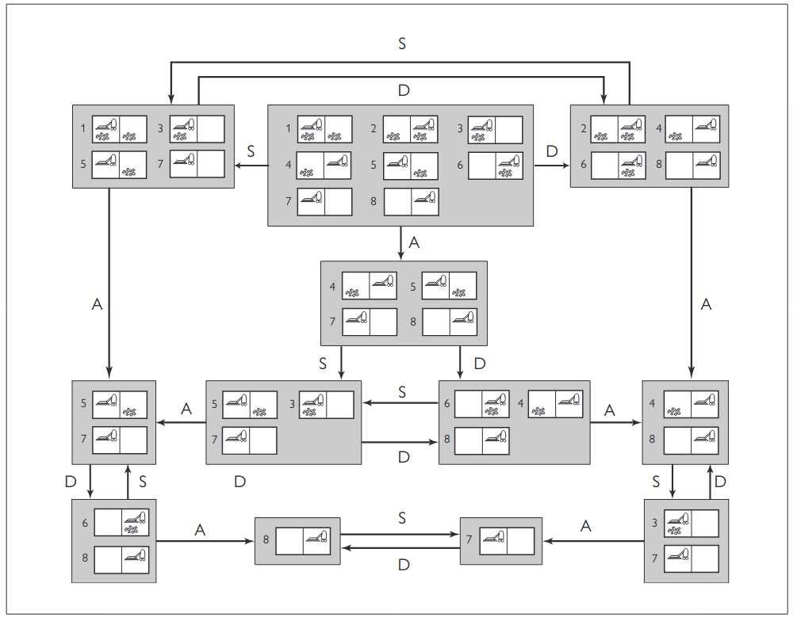

# Capitolo 4 Ricerca in ambiento complessi

## 4.1 Ricerca Locale e problemi di ottimizzazione

Gli algoritmi di ricerca locale sono una classe di metodi usati per risolvere problemi in cui ci si sposta da uno stato a un altro cercando miglioramenti graduali, senza memorizzare il percorso compiuto o gli stati visitati.

Gli algoritmi di ricerca locale sono **non sistematici**, ovvero:

- Non tengono tracci degli stati già visitati.
- Non garantiscono di esplorare tutto lo spazio degli stati, potrebbero quindi ignorare parti importanti dove si trova una soluzione migliore. Questo li distingue dagli algoritmi sistematici, come A*, che esplorano lo spazio in modo organizzato.

Tali algoritmi fanno **uso di poca memoria** in quanto memorizzano solo lo stato corrente e quello adiacente da valutare, rendendoli ideali per spazi di stati molto grandi. Spesso trovano buone soluzioni anche in spazi di stati enormi o infiniti, dove gli algoritmi sistematici sarebbero impraticabili. Sono particolarmente utili per problemi di ottimizzazione, dove si cerca uno stato che massimizzi o minimizzi una funzione obiettivo.

### 4.1.1 Ricerca hill climbing

L'algoritmo di ricerca **hill climbing** tiene traccia di un solo stato corrente e a ogni iterazione passa allo stato vicino con valore più alto, cioè punta nella direzione che presenta l'ascesa più ripida senza guardare oltre gli stati immediatamente vicini a quello corrente.
L’algoritmo hill climbing viene talvolta chiamato **ricerca locale greedy**, perché sceglie uno stato vicino “buono” senza pensare a come andrà avanti.
Sfortunatamente, spesso l’hill climbing rimane bloccato per le seguenti ragioni:

```javascript
    function HILL-CLIMBING(problema) returns uno stato che è un massimo locale
    corrente = problema.STATO_INIZIALE
    while true do
        vicino = lo stato successore di corrente di valore più alto
        if VALORE(vicino) <= VALORE(corrente) then return corrente
        corrente = vicino
```

- **massimi locali**: un massimo locale è un picco più alto degli stati vicini, ma inferiore al massimo globale. Gli algoritmi hill climbing che raggiungono la vicinanza di un massimo locale saranno attirati verso il picco, ma rimarranno bloccati lì senza poter andare altrove.
- **creste**: le creste danno origine a una sequenza di massimi locali molto difficili da esplorare da parte degli algoritmi greedy.
- **plateu**: un plateau è un’area piatta del panorama dello spazio degli stati. Può essere un massimo locale piatto, da cui non è possibile fare ulteriori progressi, oppure una spalla (shoulder), da cui si potrà salire ulteriormente. Una ricerca hill climbing potrebbe perdersi sul plateau.

{width=400px, style="display: block; margin: 0 auto"}

Alcuni miglioramenti dell'algoritmo dell'hill climbing:

In ognuno di questi casi, l’algoritmo raggiunge un punto dal quale non riesce a compiere ulteriori progressi. Per esempio per il problema delle 8 regine, risolve solo il 14% delle istanze.

1. Un modo per aumentare tale percentuale è quello di proseguire nella ricerca una volta raggiunto un plateau, consentendo una **mossa laterale** nella speranza che il plateau sia in realtà una spalla ma c'è sempre la possibilià di finire per vagare per un plateau. Possiamo quindi porre un limite al numero di mosse laterali consecutive, per esempio fermandoci dopo 100. Così si aumenta la percentuale di istanze di problemi risolte dall’algoritmo di hill climbing dal 14% al 94%.
2. **Hill climbing stocastico**: sceglie a caso tra tutte le mosse che vanno verso l’alto: la probabilità della scelta può essere influenzata dalla “pendenza” delle mosse. Normalmente questo algoritmo converge più lentamente di quello
che sceglie sempre la mossa più conveniente, ma in alcuni panorami di stati è capace di trovare soluzioni migliori.
3. **Hill climbing con prima scelta** implementa la precedente versione stocastica generando casualmente i successori fino a ottenerne uno preferibile allo stato corrente. Questa strategia è molto buona quando uno stato ha molti successori (per esempio migliaia).
4. **Hill climbing con riavvio casuale**, l’algoritmo conduce una serie di ricerche hill climbing partendo da stati iniziali generati casualmente, fino a quando raggiunge un obiettivo. È completo con probabilità 1, perché prima o poi dovrà generare, come stato iniziale, proprio un obiettivo. Se ogni ricerca hill climbing ha una probabilità $p$ di successo, il numero atteso di riavvii richiesti è $1/p$.

### 4.1.2 Simulated annealing

L'algoritmo **simulated annealing** cerca di combinare in qualche modo l’hill climbing con un’esplorazione casuale in modo da ottenere sia l’efficienza che la completezza.

La struttura complessiva dell’algoritmo simulated annealing è simile a quella dell’hill climbing: stavolta però, invece della mossa migliore, viene scelta una mossa casuale. Se la mossa migliora la situazione, viene sempre accettata; in caso contrario l’algoritmo la accetta con una probabilità inferiore a 1. La probabilità $p$ è inversamente proporzionale al peggioramento
e $T$ descresce col progredire dell’algoritmo (quindi anche $p$) secondo un piano definito.

```javascript
function SIMULATED-ANNEALING (problema, velocità_raffreddamento) returns uno stato soluzione
    corrente = problema.STATO_INIZIALE
    for t = 1 to ∞ do
        T = velocità_raffreddamento[t]
    if T = 0 then return corrente
        successivo = un successore scelto a caso di corrente
    Delta_E = VALORE(corrente) – VALORE(successivo)
    if Delta_E > 0 then corrente = successivo
    else corrente = successivo solo con probabilità pow(e, -Delta_E/T)
```

### 4.1.3 Ricerca local beam

L’algoritmo di ricerca local beam tiene traccia di $k$ stati anziché uno solo. All’inizio comincia con $k$ stati generati casualmente: a ogni passo, sono generati i successori di tutti i $k$ stati. Se uno qualsiasi di essi è un obiettivo, l’algoritmo termina; altrimenti sceglie i $k$ successori migliori dalla lista di tutti i successori e ricomincia.

La **ricerca beam stocastica**, analoga all’hill climbing stocastico, invece di scegliere i migliori $k$ successori, in questo caso si scelgono i successori con probabilità proporzionale al loro valore, aumentando così la diversificazione.

## 4.3 Ricerca con azioni non deterministiche

Quando l’ambiente è parzialmente osservabile, l’agente non sa con sicurezza in quale stato si trova; e quando l’ambiente è non deterministico, l’agente non sa in quale stato arriverà dopo l’esecuzione di un’azione. Questo significa che anziché pensare "Sono nello stato $s_1$ e se eseguo l’azione $a$ andrò nello stato $s_2$" l’agente penserà "Sono nello stato $s_1$ o $s_3$, e se eseguo l’azione $a$ passerò nello stato $s_2$, $s_4$ o $s_5$".
Chiamiamo **stato-credenza** un insieme di stati fisici che l’agente ritiene siano possibili.

In ambienti parzialmente osservabili e non deterministici, la soluzione di un problema non è una sequenza ma un piano condizionale (piano di contingenza o strategia) che specifica che cosa fare in base alle percezioni ricevute dall'agente durante l'esecuzione del piano.

### 4.3.1 Il mondo dell'aspirapolvere erratico

Introduciamo il non determinismo con un aspirapolvere potente ma erratico. Nel mondo dell’aspirapolvere erratico, l’azione `Aspira` opera come segue:

- quando applicata a un riquadro sporco, l'azione lo pulisce, ma talvolta pulisce anche un riquadro adiacente;
- quando applicata a un riquadro pulito, l'azione può, occasionalmente, depositare dello sporco sul tappeto.

Di conseguenza, dobbiamo generalizzare il modello di transizione: ora, anziché portare a uno stato deterministico, l'azione può portare a un insieme di stati possibili. L'agente, quindi, non sa con certezza in quale stato si troverà dopo aver eseguito l'azione.

Anche le soluzioni cambiano natura: non sono più semplici sequenze di mosse, ma diventano alberi decisionali. In questi alberi, è necessario definire un **piano condizionale** che includa passi `if-then-else`. In particolare:

- La condizione nell'istruzione `if` verifica lo stato corrente.
- Questa informazione sarà disponibile per l'agente al momento dell'esecuzione, ma non è nota al momento della pianificazione.

### 4.3.2 Alberi di ricerca AND-OR

In un ambiente deterministico, l'unica ramificazione è introdotta dalle scelte dell’agente in ogni stato: "Posso fare questa azione o quella"; parliamo in questo caso di nodi **OR**. Nel mondo dell’aspirapolvere, per esempio, in un nodo **OR** l’agente sceglie `Sinistra` o `Destra` o `Aspira`. In un ambiente non deterministico, la ramificazione è anche legata alla scelta del risultato per ogni azione, effettuata dall’ambiente. In questo caso parliamo di nodi **AND**. Per esempio, l’azione Aspira nello stato 1 porta a uno stato-credenza {5, 7}, perciò l’agente dovrebbe trovare un piano per lo stato 5 e per lo stato 7. Questi due tipi di nodi si alternano, generando un **albero AND-OR**.

{width=400px, style="display: block; margin: 0 auto"}

I grafi **AND-OR** possono essere esplorati dai metodi in ampiezza o best-first. Il concetto di funzione euristica deve essere modificato per stimare il costo di una soluzione contingente anzichè di una sequenza, ma la nozione di ammissibilità viene mantenuta ed esiste un analogo dell'algoritmo A* per trovare soluzioni ottime.

### 4.3.3 1 Prova, prova ancora

Consideriamo un mondo dell'aspirapolvere *scivoloso*, identico a quello dell'aspirapolvere normale (non erratico) fatta eccezione per il fatto che talvolta le azioni di movimento falliscono, lasciando l'agente nella medesima posizione.

Esiste però una **soluzione ciclica**, quella di continuare a provare `Destra` finché funziona. Possiamo esprimere questa soluzione con un nuovo costrutto `while`.

{width=400px, style="display: block; margin: 0 auto"}

## 4.4 Ricerca con osservazioni parziali

Passiamo ora al problema dell'osservabilità parziale, in cui le percezioni dell'agente non sono sufficienti per determinare lo stato esatto. Questo significa che alcune delle azioni dell'agente punteranno a ridurre l'incertezza riguardo lo stato corrente.

### 4.4.1  Ricerca in assenza di osservazioni

Quando le osservazioni dell'agente *non forniscono alcuna informazione*, abbiamo un **problema senza sensori**, talvolta detto problema **conformante**.
A prima vista si pensa che l'agente privo di sensori non abbia speranza a trovare una soluzione, ma le soluzioni senza sensori sono abbastanza comuni e utili, perché *non* si affidano al buon funzionamento dei sensori. A volte un piano senza sensori è la scelta migliore anche quando è disponibile un piano condizionale con sensori.

La soluzione di un problema senza sensori è una sequenza di azioni, non un piano condizionale (perché non vi è percezione). ma la ricerca viene effettuata nello spazio degli staticredenza e non degli stati fisici. Nello spazio degli stati-credenza il problema è completamente osservabile perché l'agente conosce sempre il proprio stato-credenza. Inoltre, la soluzione (se esiste) di un problema senza sensori è sempre una sequenza di azioni perché,
come nei problemi tradizionali, le percezioni ricevute dopo ciascuna azione sono del tutto prevedibili: sono sempre vuote! Perciò non ci sono contingenze di cui tenere conto. Questo è vero anche se l'ambiente è non deterministico.

Invece di introdurre nuovi algoritmi, possiamo usare quelli già visti in precedenza se trasformiamo il problema fisico sottostante in un problema di stati-credenza, in cui effettuiamo la ricerca in stati-credenza anziché stati fisici. Il problema originale `P` ha come componenti $\text{AZIONI}_p$, $\text{RISULTATO}_p$e così via, e il problema di stati-credenza ha i componenti seguenti.

- **Stati**: lo spazio degli stati-credenza contiene ogni possibile sottoinsieme degli stati fisici. Se $P$ ha $N$ stati, allora l'insieme degli stati-credenza ha cardinalità $2^N$.
- **Stato iniziale**: è tipicamente lo stato-credenza costituito da tutti gli $N$ stati di $P$.
- **Azioni**: Supponiamo che l'agente si trovi nello stato-credenza $b = \{s_1, s_2\}$. Se le azioni illegali non hanno nessuno effetto sull'ambiente, allora
$$AZIONI(b) = \bigcup_{s \in b} AZIONI_p(s)$$
Mentre se un azione illegale potesse portare alla catastrofe, sarebbe più sicuro considerare l'intersezione.
- **Modello di transizione**:  per azioni deterministiche, il nuovo stato-credenza contiene un solo stato risultato per ognuno dei possibili stati correnti (anche se alcuni stati risultato potrebbero coincidere)
$$b = RISULATO(b,a) = \{s' : s' = RISULTATO_p(s,a)\ e\ s \in b\}$$
Nel caso di non determinismo, il nuovo stato-credenza consiste di tutti i possibili risultati ottenuti applicando l’azione a uno qualsiasi degli stati nello stato-credenza corrente:
$$b' = RISULATO(b,a) = \{s' : s' \in RISULTATO_p(s,a)\ e\ s \in b\} = \bigcup_{s \in b} RISULTATI_p(s, a)$$
La dimensione di $b'$ sarà uguale o minore di $b$ per azioni deterministiche, ma potrebbe essere maggiore di $b$ con azioni non deterministiche.

| {width=400px, style="display: block; margin: 0 auto"}|
|:--:|
| *(a): azione deterministica. (b): azione non deterministica* |

- **Test obiettivo**: l’agente può raggiungere l’obiettivo se qualche stato $s$1 nello stato-credenza soddisfa il test obiettivo del problema sottostante, $\text{È-OBIETTIVO}_p(s)$. L’agente raggiunge sicuramente l’obiettivo se ogni stato soddisfa $\text{È-OBIETTIVO}_p(s)$.
- **Costo di azione**: Se la stessa azione può avere costi diversi in stati differenti, allora il costo di eseguire un'azione in un dato stato-credenza potrebbe essere uno tra diversi valori.

{width=400px, style="display: block; margin: 0 auto"}

1. Stati credenza possibili:

    - Si considerano tutti i possibili stati credenza (insiemi di stati in cui l'agente potrebbe trovarsi). Ad esempio, se ci sono 8 variabili di stato, ci sono $2^8 = 256$ stati possibili.
    - Tuttavia, non tutti questi stati sono effettivamente raggiungibili a causa delle limitazioni del problema. Solo 12 stati credenza raggiungibili vengono considerati in questo caso specifico.

2. Ricerca-grafo:

    - Durante la ricerca, si genera uno stato $s$. Se uno stato credenza $s'$ equivalente a $s$ è già stato incontrato, $s$ può essere ignorato (potatura).
    - Questo è utile per evitare di analizzare stati giò esplorati e migliorare l'efficienza.

3. Potatura più efficace:

    - Caso 1: $s' \subseteq s$
        Se lo stato credenza $s'$ (già incontrato) è un sottoinsieme di $s$, significa che $s$ non aggiunge nuove informazioni e può essere ignorato.
    - Caso 2: $s \subseteq s'$
        Se $s$ è un sottoinsieme di $s'$ e da $s'$ si è già trovata una soluzione, non serve esplorare ulteriormente $s$.

### 4.4.2 Ricerca in ambienri parzialmente osservabili

In ambienti parzialmente osservabili, La funzione $PERCEZIONE(s)$ rappresenta il modo in cui un agente percepisce l'ambiente in un determinato stato $s$.
La funzione $PERCEZIONE(s)$ serve a modellare quanto l'agente sa del mondo:

1. **Completamente osservabile**: L'agente sa esattamente in che stato si trova, infatti $PERCEZIONE(s) = s$
2. **Parzialmente osservabile**: L'agente riceve informazioni incomplete o imprecise, infatti $PERCEZIONE(s)$ restituisce ciò che l'agente percepisce dallo stato $s$.
3. **Sensorless (senza sensori)**: L'agente non sa nulla sullo stato corrente.

In ambienti non deterministivi, la funzione $PERCEZIONE(s)$ restituisce un insieme di possibili percezioni per uno stato $s$.

Questo influisce su come l'agente pianifica e prende decisioni:

- Con informazioni complete, la pianificazione è più semplice.
- Con informazioni incomplete o nulle, l'agente deve ragionare su insiemi di stati (stati credenza).

Il modello di transizione tra stati-credenza per problemi parzialmente osservabili opera in tre fasi:

- La fase di **predizione** calcola lo stato-credenza risultante dall'azione, $\tilde{b} = RISULTATO(b,a)$, esattamente come nei problemi senza sensori.
- La fase delle **percezioni possibili** calcola l’insieme delle percezioni che potrebbero essere osservate nello stato-credenza predetto.
$$PERCEZIONI-POSSIBILI(\tilde{b}) = \{o: o = PERCEZIONE(s)\ e\ s \in \tilde{b}\}$$
- La fase di **aggiornamento** calcola, per ogni possibile percezione, lo stato-credenza che risulterebbe da essa. Lo stato-credenza aggiornato $b_o$ è semplicemente l'insieme degli stati di $\tilde{b}$ che potrebbero aver prodotto la percezione
$$b_o = AGGIORNA(\tilde{b}, o) = \{s: o = PERCEZIONE(s)\ e\ s\in \tilde{b}\}$$

### 4.4.3 Risoluzione di problemi parzialmente osservabili

Abbiamo visto come derivare la funzione $RISULATI$ per un problema con stati-credenza non deterministico a partire da un problema fisico sottostante, data la funzione $PERCEZIONE$. Con questa formulazione, l’algoritmo di ricerca **AND-OR** della può essere applicato direttamente per ricavare una soluzione. Poiché abbiamo fornito all'algoritmo di ricerca **AND-OR** un problema di stato-credenza, viene restituito un piano condizionale che controlla lo stato-credenza anziché lo stato effettivo. È giusto così: in un ambiente parzialmente osservabile l'agente non sarà in grado di conoscere lo stato effettivo.

### 4.4.4 Un agente per ambienti parzialmente osservabili

Un agente per ambienti parzialmente osservabili formula un problema, invoca un algoritmo di ricerca (come **RICERCA AND-OR**) per risolverlo ed esegue la soluzione. Ci sono due differenze principali fra questo agente e uno per ambienti completamente osservabili e deterministici:

1. In primo luogo, la soluzione sarà un piano condizionale anziché una sequenza; se il primo passo è un’espressione `if-then-else`, l’agente dovrà verificare la condizione ed eseguire il ramo appropriato dell’istruzione condizionale.
2. In secondo luogo, l’agente dovrà mantenere il proprio stato-credenza mente esegue azioni e riceve percezioni.

In ambienti parzialmente osservabili, ovvero nella grande maggioranza degli ambienti del mondo reale, mantenere lo stato-credenza è una funzione centrale di qualsiasi sistema intelligente. Questa funzione è chiamata in vari modi, tra cui **monitoraggio**, **filtro** e **stima dello stato**.
$$b' = AGGIORNA(PREDIZIONE(b, a), o)$$
è chiamata *stimatore di stato ricorsivo* perché calcola il nuovo stato-credenza sulla base del precedente anziché dell’intera sequenza di percezioni.

## 4.5 Agenti per ricerca online e ambienti sconosciuti

La ricerca online è un approccio in cui un agente alterna tra azione e calcolo, anziché pianificare l'intera soluzione prima di agire (come nella ricerca offline). È utile in ambienti:

- **Dinamici o semidinamici**, dove non c'è tempo per pianificare tutto in anticipo.
- **Non deterministici**, dove il risultato di un'azione può essere incerto.

!!! note
    Il termine "online" qui si riferisce ad algoritmi che devono elaborare i dati in input nel momento in cui sono ricevuti, invece di aspettare di averli tutti disponibili. In questo senso, il termine non è correlato al concetto di "essere connessi a Internet".

La ricerca online consente all'agente di concentrarsi sulle situazioni che realmente si verificano, riducendo il calcolo su scenari ipotetici improbabili. Tuttavia, pianificare di meno comporta il rischio di "cacciarsi nei guai". In ambienti ignoti, l'agente usa le sue azioni per **esplorare** e **apprendere** come funziona l'ambiente (ad esempio, mappare un edificio sconosciuto o uscire da un labirinto).

Differenza tra ricerca offline e online

- Ricerca offline:
  - L'agente calcola una soluzione completa prima di agire.
  - È ideale in ambienti statici e deterministici, dove gli stati e gli effetti delle azioni sono noti.
  - Esempio: Calcolare un percorso completo su Google Maps prima di partire.
- Ricerca online:
  - L'agente esegue un'azione, osserva l'ambiente, e poi calcola l'azione successiva.
  - Si adatta meglio a situazioni dove gli stati non sono noti in anticipo, gli effetti delle azioni sono incerti, o l'ambiente può cambiare.
  - Esempio: Un robot che esplora un edificio sconosciuto, costruendo la mappa mano a mano.

### 4.5.1 Problemi di ricerca online
